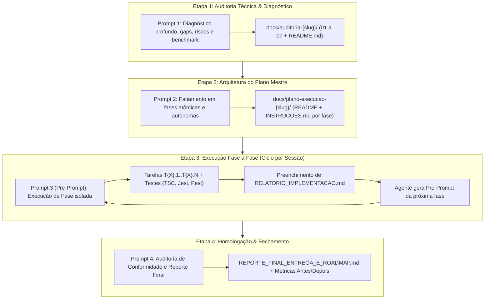

# Template Mestre: Fluxo de Trabalho e Prompts de Implementação — UniEspaços

> **Documento de Referência:** Template padronizado de prompts e metodologia para condução de auditorias, planejamento mestre, execuções atômicas em sessões isoladas e relatórios de homologação técnica no ecossistema **UniEspaços**.  
> **Baseado nas Metodologias:** `docs/auditoria-design-2/`, `docs/plano-execucao-design-2/` e `docs/plano-update-app/`.

---

## 🎯 Visão Geral do Ciclo de Desenvolvimento

O fluxo de trabalho do UniEspaços é dividido em **4 etapas sequenciais** para garantir máxima qualidade técnica, conformidade com regras de negócio, zero saturação de contexto em LLMs e documentação rastreável:



---

## 📑 Índice dos Templates de Prompts

1. [Prompt 1: Auditoria Técnica e Diagnóstico Inicial](#-prompt-1-auditoria-técnica-e-diagnóstico-inicial)
2. [Prompt 2: Criação do Plano de Execução Mestre e Estrutura de Pastas](#-prompt-2-criação-do-plano-de-execução-mestre-e-estrutura-de-pastas)
3. [Prompt 3: Execução de Fase Atômica (Pre-Prompt por Conversa)](#-prompt-3-execução-de-fase-atômica-pre-prompt-por-conversa)
4. [Prompt 4: Consolidação Final, Auditoria de Conformidade e Reporte Executivo](#-prompt-4-consolidação-final-auditoria-de-conformidade-e-reporte-executivo)
5. [Estrutura Padrão de Arquivos (`INSTRUCOES.md` e `RELATORIO_IMPLEMENTACAO.md`)](#-estrutura-padrão-de-arquivos)

---

## 🔍 Prompt 1: Auditoria Técnica e Diagnóstico Inicial

> **Quando usar:** No início de qualquer iniciativa técnica de médio/grande porte (novo recurso, refatoração de arquitetura, modernização visual ou atualização de dependências).

```markdown
# PROMPT: Auditoria Técnica e Diagnóstico — {{NOME_DO_TEMA}}

Atue como Arquiteto de Software Sênior e Especialista no ecossistema do UniEspaços (Laravel 12 + Inertia 2 + React 19 + Tailwind v4 + PostgreSQL 16 + Reverb).

Realize uma auditoria técnica profunda e minuciosa com foco em: **{{OBJETIVO_DA_AUDITORIA}}**.

### 🔍 Diretrizes de Análise
1. **Varredura no Código Atual:** Analise os arquivos em `{{DIRETORIOS_CHAVE}}` identificando gargalos, duplicações, débitos técnicos, violações de arquitetura e oportunidades de melhoria.
2. **Benchmark & Melhores Práticas:** Acesse na internet as referências técnicas mais recentes de {{TECNOLOGIAS_ENVOLVIDAS}}(ex: React 19, Tailwind v4, Shadcn UI, Laravel 12, Inertia v2, Vaul), e traga trechos importantes para o nosso contexto.
3. **Matriz de Riscos & Regras de Negócio:** Identifique o que pode quebrar (autorizações Spatie/Policies, Soft-Deletes com confirmação de senha, canais de WebSocket Reverb, integridade de transações de banco).

### 📁 Estrutura de Entrega em `docs/auditoria-{{SLUG_TEMA}}/`
Crie o diretório `docs/auditoria-{{SLUG_TEMA}}/` contendo relatórios numerados em Markdown:
- `README.md`: Visão geral, objetivos da auditoria, índice analítico e resumo executivo.
- `01-{{TOPICO_1}}.md`: Diagnóstico arquitetural da stack atual.
- `02-{{TOPICO_2}}.md`: Levantamento de lacunas, componentes/serviços a refatorar ou substituir.
- `03-{{TOPICO_3}}.md`: Padrões técnicos, contratos de interface, rotas e ergonomia.
- `04-{{TOPICO_4}}.md`: Matriz de impactos, riscos identificados e estratégias de mitigação.
- `05-{{TOPICO_5}}.md`: Sugestão de roadmap priorizado e estratégia de fases atômicas.

⚠️ **Atenção:** Não faça alterações em código nesta etapa. Foque em documentar o diagnóstico com máxima precisão técnica.
```

---

## 🏗️ Prompt 2: Criação do Plano de Execução Mestre e Estrutura de Pastas

> **Quando usar:** Após a conclusão e aprovação da auditoria para gerar toda a estrutura de pastas, arquivos de instruções e checklist.

```markdown
# PROMPT: Criação do Plano de Execução Mestre — {{NOME_DO_TEMA}}

Com base nas conclusões e no roadmap documentados em `docs/auditoria-{{SLUG_TEMA}}/`, elabore o **Plano de Execução Mestre** seguindo a metodologia de fases atômicas e documentação operacional do projeto (conforme `docs/plano-execucao-design-2/`).

### 📂 Estrutura de Pastas e Arquivos a Ser Criada
Crie o diretório `docs/plano-execucao-{{SLUG_TEMA}}/` com a seguinte estrutura:

docs/plano-execucao-{{SLUG_TEMA}}/
├── README.md                           # Índice mestre, diagrama Mermaid das fases e regras invioláveis
├── AUDITORIA_CONFORMIDADE_REGRAS.md    # Matriz de conformidade de regras de negócio (zero regressões)
├── fase-01-{{SLUG_FASE_1}}/
│   ├── INSTRUCOES.md                   # Guia passo a passo com tarefas T1.1..T1.N, riscos e testes
│   └── RELATORIO_IMPLEMENTACAO.md      # Template vazio para preenchimento pós-execução
├── fase-02-{{SLUG_FASE_2}}/
│   ├── INSTRUCOES.md
│   └── RELATORIO_IMPLEMENTACAO.md
└── ... (demais fases planejadas)

### 📋 Requisitos para cada `INSTRUCOES.md`:
1. **Metadados do Cabeçalho:** Diretório, Objetivo, Severidade/Ganho e Nível de Independência.
2. **Norte de Estudo & Leitura Prévia:** Links de documentações oficiais e arquivos locais da auditoria.
3. **Tarefas Atômicas Detalhadas:** Tarefas nomeadas (`T{X}.1`, `T{X}.2`...) com *Arquivo Alvo*, *Ação*, *Antes* e *Depois* em blocos de código.
4. **O Que Pode Quebrar & Como Mitigar:** Tabela (Risco, Probabilidade, Impacto, Estratégia de Mitigação).
5. **Comandos de Validação Automatizada:** `npx tsc --noEmit`, `npx jest`, testes Laravel no Docker (`docker exec -e APP_ENV=testing uniespacos-workspace-1 php artisan test`) e linters.
6. **Critérios de Aceite:** Checklist objetivo (`[ ]`).
7. **Obrigação do Agente ao Concluir:** Preencher o `RELATORIO_IMPLEMENTACAO.md` e gerar o **Pre-Prompt da próxima fase**.

Ao finalizar a criação de toda a estrutura documental, forneça o **Pre-Prompt pronto da Fase 1** para iniciarmos a implementação em uma nova sessão de chat limpa.
```

---

## ⚡ Prompt 3: Execução de Fase Atômica (Pre-Prompt por Conversa)

> **Quando usar:** Ao iniciar uma nova sessão limpa de chat para executar uma fase específica do plano.

```markdown
# PROMPT: Execução da Fase {{NUMERO_FASE}} — {{TITULO_FASE}}

Execute a **Fase {{NUMERO_FASE}}** do Plano de Execução {{NOME_DO_PLANO}}: "{{TITULO_FASE}}".

### 📖 Documentos de Leitura Obrigatória:
- Instruções detalhadas: `docs/plano-execucao-{{SLUG_PLANO}}/fase-{{NUMERO_2_DIGITOS}}-{{SLUG_FASE}}/INSTRUCOES.md`
- Auditoria de apoio: `docs/auditoria-{{SLUG_PLANO}}/{{ARQUIVO_AUDITORIA_RELACIONADO}}.md`
- Conformidade de regras: `docs/plano-execucao-{{SLUG_PLANO}}/AUDITORIA_CONFORMIDADE_REGRAS.md`

### 🛠️ Protocolo de Execução:
1. Execute as tarefas atômicas (**T{{NUMERO_FASE}}.1** a **T{{NUMERO_FASE}}.N**) estritamente conforme especificado no `INSTRUCOES.md`.
2. Não altere arquivos fora do escopo desta fase sem necessidade justificada.
3. Preserve todas as regras de negócio e autorizações (Policies, Spatie, Soft-Delete com senha, WebSockets).
4. Execute as validações automatizadas:
   - `npx tsc --noEmit`
   - `npx jest` (criando ou atualizando testes unitários para garantir cobertura dos arquivos modificados)
   - `docker exec -e APP_ENV=testing uniespacos-workspace-1 php artisan test` (quando envolver backend)
5. Ao concluir com 100% de sucesso nos testes:
   - Preencha o arquivo `docs/plano-execucao-{{SLUG_PLANO}}/fase-{{NUMERO_2_DIGITOS}}-{{SLUG_FASE}}/RELATORIO_IMPLEMENTACAO.md` com as alterações feitas e os outputs reais dos testes.
   - Forneça em sua resposta final o **Pre-Prompt completo da Fase {{PROXIMO_NUMERO}}**, formatado e pronto para ser copiado para a próxima sessão de chat.
```

---

## 📊 Prompt 4: Consolidação Final, Auditoria de Conformidade e Reporte Executivo

> **Quando usar:** Ao concluir a última fase do plano de execução para homologar a entrega global e gerar métricas.

```markdown
# PROMPT: Consolidação e Relatório Executivo de Entrega — {{NOME_DO_PLANO}}

Todas as fases do **{{NOME_DO_PLANO}}** foram executadas com sucesso. Agora, elabore o documento de consolidação e homologação final: `docs/plano-execucao-{{SLUG_PLANO}}/REPORTE_FINAL_ENTREGA_E_ROADMAP.md`.

### 📊 Conteúdo Obrigatório do Relatório:
1. **Consolidação Estruturada das Fases Entregues:** Diagrama Mermaid de fluxo e resumo detalhado dos ganhos de cada fase.
2. **Métricas & Ganhos Mensurados:** Tabela comparativa clara de *Estado Anterior* vs *Estado Atual Homologado* (ex: tamanho do bundle, tempo de carregamento, alvos de toque, CLS, cobertura de testes Jest e Laravel).
3. **Evidências de Testes e Homologação:** Resumo dos comandos executados e taxa de sucesso (zero regressões).
4. **Roadmap de Evolução:** Diagnóstico priorizado de próximos passos e áreas não modificadas que podem ser abordadas no próximo ciclo de desenvolvimento.
```

---

## 📐 Estrutura Padrão de Arquivos

### 📄 Modelo de `INSTRUCOES.md` (Para cada fase)

```markdown
# Fase {{X}}: {{Título da Fase}}

> **Diretório:** `docs/plano-execucao-{{slug}}/fase-{{0X}}-{{slug}}/`  
> **Objetivo:** {{Descrição concisa de 1 a 2 parágrafos do objetivo técnico}}  
> **Severidade / Ganho:** 🟢/🟡/🔴 {{Classificação do impacto}}  
> **Independência:** {{100% autônoma / Depende apenas da Fase X}}

---

## 📖 1. Norte de Estudo & Leitura Prévia Obrigatória

1. **Documentação Local de Auditoria:**  
   `docs/auditoria-{{slug}}/{{arquivo}}.md` (*Resumo do que consultar*)
2. **Documentação Oficial Externa:**  
   [{{Nome da Lib}}]({{URL}}) — *Conceito chave a dominar*

---

## 🛠️ 2. Tarefas Atômicas Detalhadas

### 🔹 Tarefa T{{X}}.1: {{Nome da Tarefa}}
- **Arquivo Alvo:** `resources/js/...` ou `app/...`
- **Ação:** {{Instrução clara da modificação}}
- **Antes / Depois:**
  ```tsx
  // Antes
  ...
  // Depois
  ...
  ```

---

## ⚠️ 3. O Que Pode Quebrar & Como Mitigar

| Risco | Probabilidade | Impacto | Estratégia de Mitigação |
|---|---|---|---|
| {{Descrição do Risco}} | Baixa / Média / Alta | Baixo / Médio / Alto | {{Ação preventiva ou corretiva}} |

---

## 🛠️ 4. Comandos de Validação Automatizada

```bash
# 1. Checagem de tipos
npx tsc --noEmit

# 2. Testes de frontend
npx jest

# 3. Testes de backend
docker exec -e APP_ENV=testing uniespacos-workspace-1 php artisan test
```

---

## ✅ 5. Critérios de Aceite

- [ ] {{Critério 1}}
- [ ] {{Critério 2}}
- [ ] `npx tsc --noEmit` retorna código 0.
- [ ] 100% dos testes unitários passando.

---

## 📄 6. Relatório de Implementação Obrigatório

Ao finalizar esta fase, preencha o arquivo `RELATORIO_IMPLEMENTACAO.md` nesta mesma pasta.

---

## 🤖 7. Obrigação do Agente ao Concluir a Fase: Geração do Pre-Prompt da Próxima Fase

Ao terminar a execução de todas as tarefas e verificar que todos os testes passaram:
1. Preencha o arquivo `RELATORIO_IMPLEMENTACAO.md` nesta pasta.
2. **Gere em sua resposta final ao usuário o Pre-Prompt completo para a Fase {{X+1}}**, pronto para ser copiado e colado em uma nova sessão do chat.
```

---

### 📄 Modelo de `RELATORIO_IMPLEMENTACAO.md`

```markdown
# Relatório de Implementação — Fase {{X}}: {{Título da Fase}}

- **Data de Conclusão:** {{AAAA-MM-DD}}
- **Executor:** Antigravity / Pair Programming
- **Status:** Concluído com Sucesso

---

## 📝 1. Alterações Realizadas

- [x] **T{{X}}.1:** {{Resumo da alteração 1}}
- [x] **T{{X}}.2:** {{Resumo da alteração 2}}

---

## 🧪 2. Evidências de Testes e Validações

### 🔹 Checagem de Tipos TypeScript (`npx tsc --noEmit`)
```text
$ npx tsc --noEmit
# Código de saída 0 (sem erros)
```

### 🔹 Testes Unitários de Frontend (`npx jest`)
```text
Test Suites: X passed, X total
Tests:       Y passed, Y total
```

### 🔹 Testes do Backend Laravel (`php artisan test`)
```text
Tests:    Z passed
Assertions: W
```

---

## 💡 3. Decisões Técnicas e Desvios Controlados

1. **{{Decisão 1}}:** {{Justificativa técnica}}
2. **{{Decisão 2}}:** {{Justificativa técnica}}
```
