# UniEspaços — Core Workflow Report
> Última atualização: 2026-08-22 | Diagrama completo do fluxo de reservas, campos, validação e notificações

## Índice

1. [Visão Geral do Sistema](#visão-geral)
2. [Modelo de Dados Central](#modelo-de-dados)
3. [Estados da Reserva e Eixo de Arquivamento](#estados)
4. [Fluxo Completo de Criação](#fluxo-criação)
5. [Fluxo de Avaliação pelo Gestor](#fluxo-avaliação)
6. [Regra de Status Agregado](#status-agregado)
7. [Cascata de Revalidação](#cascata)
8. [Fluxo de Cancelamento](#cancelamento)
9. [Sistema de Notificações](#notificações)
10. [Eixos de Filtro](#eixos-de-filtro)
11. [Validação de Conflitos](#validação-conflitos)
12. [Árvore Frontend](#frontend-tree)
13. [Arquitetura Backend](#arquitetura)
14. [Gaps Conhecidos](#gaps)
15. [Referências de Código](#referências)

---

## 1. Visão Geral do Sistema {#visão-geral}

UniEspaços é uma aplicação web de reserva de espaços acadêmicos com arquitetura full-stack desacoplada:

| Camada | Tecnologia |
|--------|-----------|
| Backend | Laravel 12.x (PHP) |
| Frontend | React 18 + Inertia.js (SPA) |
| Database | PostgreSQL 16 |
| Real-time | Laravel Reverb (WebSockets via Broadcast) |
| Queue | Laravel Queue (background jobs) |
| Auth / RBAC | Spatie Laravel Permission |

O **fluxo central** da aplicação tem dois atores principais:
- **Solicitante** — qualquer usuário autenticado que solicita a reserva de um espaço.
- **Gestor** — usuário com permissão `secao.gestao-reservas` que avalia as solicitações de reserva.

---

## 2. Modelo de Dados Central {#modelo-de-dados}

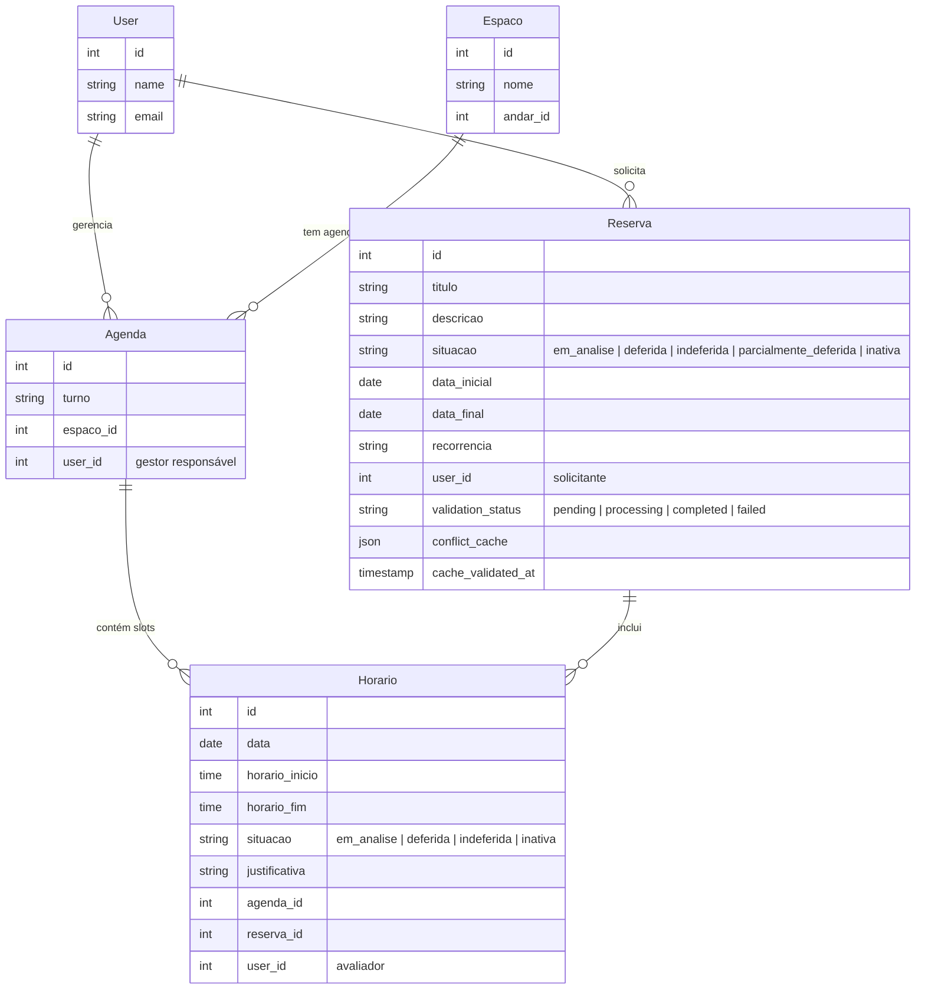

**Relação chave:** Uma `Reserva` agrupa vários `Horario`s. Cada `Horario` pertence a uma `Agenda` (que é vinculada a um `Espaco` e tem um `User` gestor). O status final da `Reserva` é **derivado** do conjunto de status dos seus `Horario`s.

### Campos de Validação e Cache

| Campo | Tipo | Descrição |
|-------|------|-----------|
| `validation_status` | ENUM (pending\|processing\|completed\|failed) | Estado da validação assíncrona de conflitos. Começa em `pending`, passa por `processing` enquanto o job roda, termina em `completed` (sucesso) ou `failed`. |
| `conflict_cache` | JSON | Mapa de conflitos detectados pelo `ValidateReservationConflictsJob`. Armazena pares `horario_id → dados do conflito`. Atualizado pela cascata de revalidação. |
| `cache_validated_at` | TIMESTAMP | Timestamp da última validação bem-sucedida. Usado para detectar quando o cache ficou obsoleto (ex.: após update da reserva). |

---

## 3. Estados da Reserva e Eixo de Arquivamento {#estados}

### 3.1 Separação: Situação vs Arquivo

**Situação** é o resultado da **avaliação** (quem aprova/rejeita a reserva):
- `em_analise`: aguardando avaliação do gestor
- `deferida`: aprovada
- `indeferida`: rejeitada
- `parcialmente_deferida`: mix de aprovados e rejeitados

**Arquivo** é um estado de **exclusão lógica** (arquivar = remover da visão padrão):
- `inativa`: reserva arquivada (cancelada ou excluída)

**Por quê separar?** Historicamente, `inativa` era tratada no mesmo field que os outros status, causando filtros contraditórios (ex.: "mostrar inativas E em_analise"). Agora:
- Use `situacao` para filtrar por **resultado de avaliação** (4 valores)
- Use `arquivo` (via `ModoArquivoEnum`) para filtrar por **visibilidade** (ATIVAS / ARQUIVADAS / TODAS)

Ver seção [4.5 Eixos de Filtro](#eixos-de-filtro).

### 3.2 Diagrama de Transição de Estados

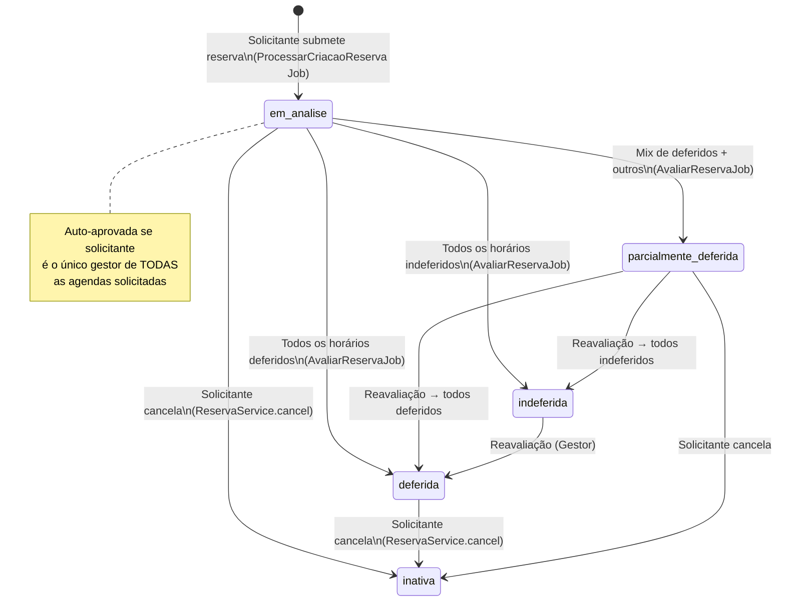

### 3.3 Regra de Auto-Aprovação

Se o solicitante for o **único gestor de TODAS as agendas** na reserva:
- Todos os horários nascem com `situacao = deferida`
- A reserva nasce com `situacao = deferida`
- Notificações gestores **não** são enviadas (pois solicitante = gestor)
- **Supressão de email:** O canal `mail` é omitido (apenas `database` e `broadcast`)

Ver seção [Notificações](#sistema-de-notificações) para detalhe de supressão.

Se solicitante é gestor de **ALGUMAS** (mas não todas) agendas:
- Horários das agendas que gerencia nascem com `situacao = deferida`
- Horários de agendas de outros gestores nascem com `situacao = em_analise`
- Reserva nasce com `situacao = parcialmente_deferida`

---

## 4. Fluxo Completo de Criação de Reserva {#fluxo-criação}

### 4.1 Frontend — Seleção de Slots

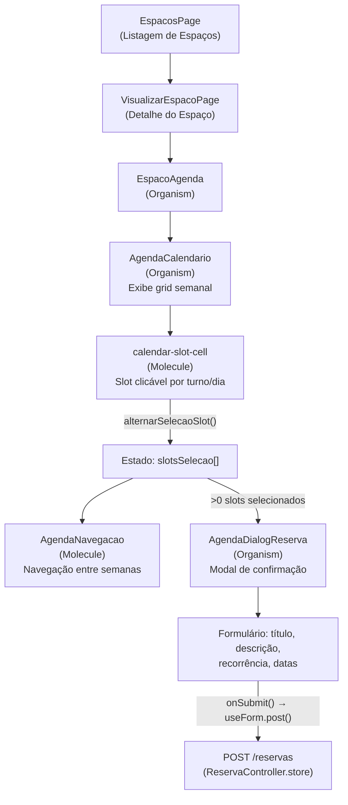

### 4.2 Backend — Processamento Assíncrono

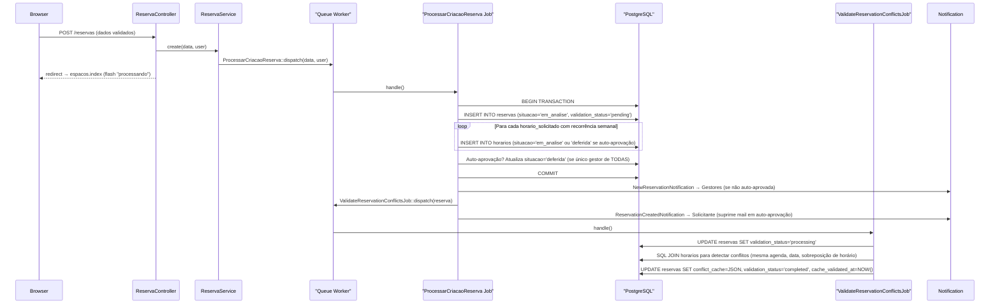

### 4.3 Pipeline de Validação de Conflitos

O field `validation_status` acompanha o progresso do `ValidateReservationConflictsJob`:

| Status | Significado | Transição automática |
|--------|-------------|-----|
| `pending` | Job não iniciado ainda | → `processing` quando job inicia |
| `processing` | Job rodando, detectando conflitos | → `completed` ou `failed` |
| `completed` | Validação terminada com sucesso; `conflict_cache` está atualizado | Permanece até próxima revalidação |
| `failed` | Job falhou após retries; cache pode estar desatualizado | Manual (não há retry automático) |

**Nota:** Durante `pending` ou `processing`, a `AvaliarReservaPage` (gestor) exibe um spinner e bloqueia avaliação, pois não há conflitos verificados ainda.

---

## 5. Fluxo de Avaliação pelo Gestor {#fluxo-avaliação}

### 5.1 Frontend — Tela de Avaliação

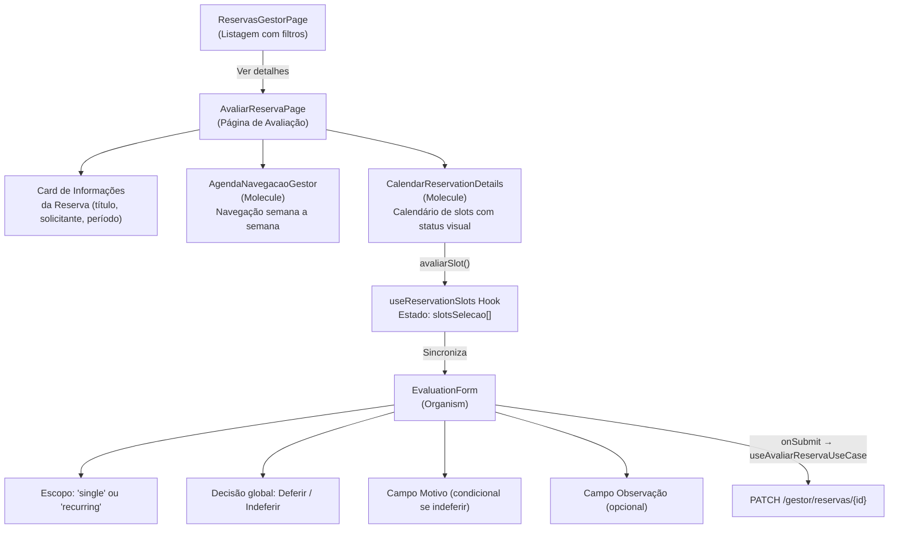

> **Nota importante:** O `AvaliarReservaPage` detecta `validation_status === 'processing'` ou `'pending'` e exibe um loading spinner em vez do formulário, evitando avaliação antes da validação de conflitos terminar.

### 5.2 Backend — Processamento da Avaliação

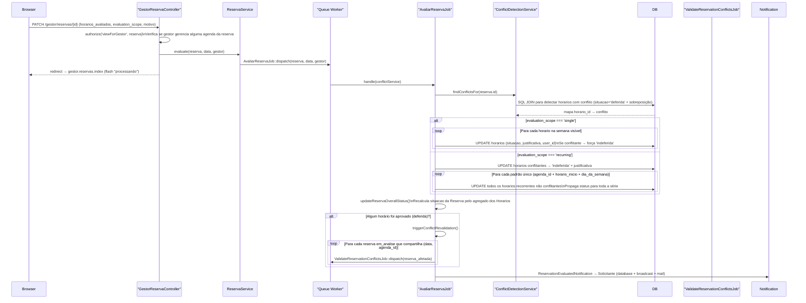

---

## 6. Regra de Status Agregado da Reserva {#status-agregado}

A situação final da `Reserva` é calculada em `AvaliarReservaJob::updateReservaOverallStatus()`:

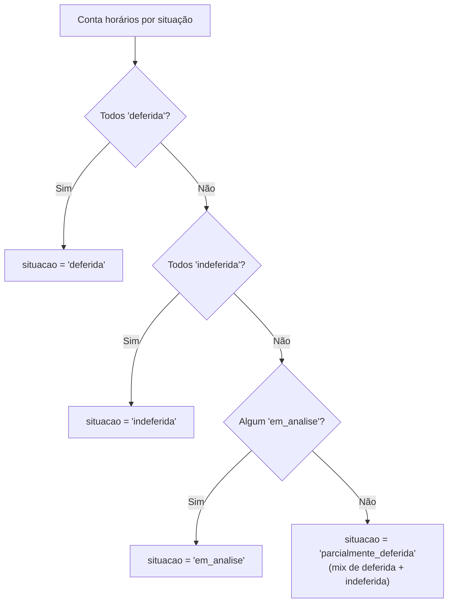

---

## 7. Cascata de Revalidação de Conflitos {#cascata}

Quando o gestor aprova horários (`deferida`), o sistema automaticamente revalida outras reservas que disputam os mesmos slots. Isso evita que o cache de conflitos de outras reservas fique obsoleto.

### 7.1 Mecanismo

1. **Identificação de aprovações:** AvaliarReservaJob detecta quais horários foram aprovados (status `deferida`) nesta avaliação.

2. **Busca de afetadas:** Procura outras reservas que:
   - Estão em `situacao = 'em_analise'` (pendentes de avaliação)
   - Têm `validation_status = 'completed'` (já validadas)
   - Compartilham pelo menos um slot (`data`, `agenda_id`) com os horários recém-aprovados

3. **Revalidação:** Para cada reserva afetada, dispara `ValidateReservationConflictsJob` para:
   - Re-detectar conflitos contra os novos horários aprovados
   - Atualizar `conflict_cache` com conflitos atualizados
   - Atualizar `cache_validated_at`

### 7.2 Diagrama

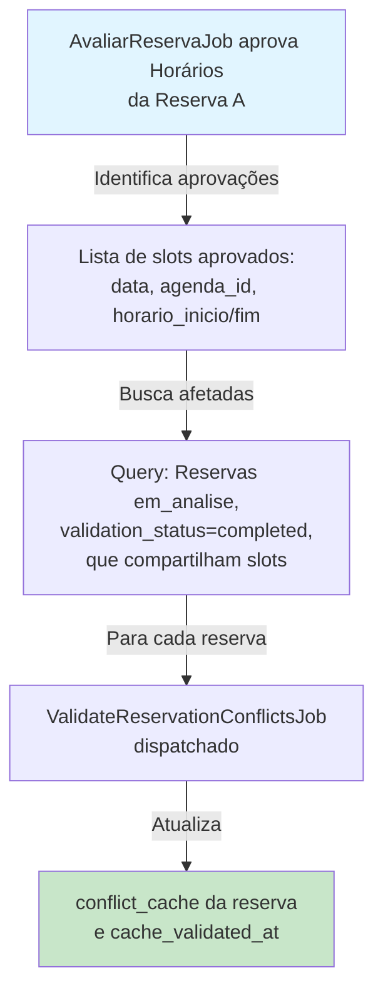

### 7.3 Exemplo Prático

- **Reserva A:** Solicitante pede segundo-feira 14h na Agenda X. Fica em análise.
- **Reserva B:** Outro solicitante pede segunda-feira 14h na mesma Agenda X. Fica em análise, sem conflitos iniciais (pois A ainda não foi aprovada).
- **Gestor aprova A:** `ValidateReservationConflictsJob` roda e marca os horários de A como `deferida`.
- **Cascata:** AvaliarReservaJob detecta que B compartilha a mesma Agenda+Data+Hora, dispara novo `ValidateReservationConflictsJob` para B.
- **B re-validado:** O novo job detecta conflito de B com A agora, atualiza `conflict_cache` de B.

> **Objetivo:** Garantir que o gestor sempre veja o estado atual de conflitos ao avaliar uma reserva, mesmo que outra tenha sido aprovada após a submissão.

---

## 8. Fluxo de Cancelamento {#cancelamento}

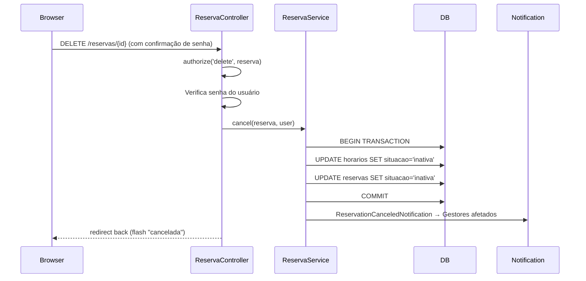

> **Nota:** O cancelamento é **síncrono** (não usa job/queue), diferente da criação e avaliação.

---

## 9. Sistema de Notificações {#notificações}

Todas as notificações relacionadas a reserva estendem `BaseNotification` que implementa `ShouldQueue`:

### 9.1 Canais de Entrega

| Canal | Tecnologia | Timing | Quando suprimido |
|-------|-----------|--------|-----------------|
| `database` | Laravel notifications table | Sempre ativo | Nunca |
| `broadcast` | Laravel Reverb (WebSocket) | Entrega em tempo real | Nunca |
| `mail` | SMTP / Mailtrap | Assíncrono (fila) | Em auto-aprovação (veja 9.3) |

O canal `broadcast` permite que o frontend (`notification-dropdown.tsx`) receba notificações em tempo real via WebSocket.

### 9.2 Notificações de Reserva

| Notificação | Destinatário | Disparada por | Quando |
|-------------|---|---|---|
| `NewReservationNotification` | Gestores das agendas | `ProcessarCriacaoReserva` | Quando nova reserva é criada (se não auto-aprovada) |
| `ReservationCreatedNotification` | Solicitante | `ProcessarCriacaoReserva` | Após criação (sempre, mas mail suprimido em auto-aprovação) |
| `ReservationEvaluatedNotification` | Solicitante | `AvaliarReservaJob` | Após gestor avaliar e finalizar a reserva |
| `ReservationCanceledNotification` | Gestores afetados | `ReservaService.cancel()` | Quando solicitante cancela a reserva |
| `ReservationUpdatedNotification` | Solicitante | `UpdateReservaJob` | Após edição da reserva (atualização de horários) |
| `ReservationFailedNotification` | Solicitante | `ProcessarCriacaoReserva.failed()` | Quando criação falha após 3 retries |
| `ReservationUpdateFailedNotification` | Solicitante | `UpdateReservaJob.failed()` | Quando atualização falha após 3 retries |

### 9.3 Supressão de E-mail em Auto-Aprovação

Quando o solicitante é o **único gestor de TODAS as agendas** da reserva (auto-aprovação):

- **Para `NewReservationNotification`:** Não é enviada (o solicitante é o gestor, não precisa de "nova reserva")
- **Para `ReservationCreatedNotification`:** É enviada, mas o canal `mail` é omitido (mantém `database` e `broadcast`)

**Implementação:** `BaseNotification.via()` detecta:
```php
$isApplicant = $reserva->user_id === $notifiable->id;
$managerIds = Agenda::...$reserva->horarios...; // IDs únicos de gestores
$isSoleManager = $managerIds->count() === 1 && $managerIds->first() === $notifiable->id;

if ($isApplicant && $isSoleManager) {
    return ['database', 'broadcast']; // Sem mail
}
return ['database', 'broadcast', 'mail'];
```

### 9.4 Diagrama de Fluxo

```mermaid
graph TD
    subgraph "Canais"
        DB["database"]
        BC["broadcast"]
        ML["mail"]
    end

    N1["NewReservationNotification<br/>(nova reserva)"] -->|Gestor| DB & BC & ML
    N2["ReservationCreatedNotification<br/>(criada)"] -->|Solicitante| DB & BC
    N2 -->|se NÃO auto-aprovação| ML
    
    N3["ReservationEvaluatedNotification<br/>(avaliada)"] -->|Solicitante| DB & BC & ML
    N4["ReservationCanceledNotification<br/>(cancelada)"] -->|Gestores| DB & BC & ML
    N5["ReservationUpdatedNotification<br/>(atualizada)"] -->|Solicitante| DB & BC & ML
    N6["ReservationFailedNotification<br/>(falha criação)"] -->|Solicitante| DB & BC & ML
    N7["ReservationUpdateFailedNotification<br/>(falha atualização)"] -->|Solicitante| DB & BC & ML
    
    style N2 fill:#fff3e0
```

---

## 10. Eixos de Filtro: Situação vs Arquivo {#eixos-de-filtro}

### 10.1 ModoArquivoEnum

As listagens de reservas suportam dois eixos de filtro **independentes**:

| Eixo | Enum | Valores | Padrão | Descrição |
|------|------|---------|--------|-----------|
| **Avaliação** | `SituacaoReservaEnum` | em_analise, deferida, indeferida, parcialmente_deferida | Sem filtro | Resultado da avaliação pelo gestor |
| **Visibilidade** | `ModoArquivoEnum` | ATIVAS, ARQUIVADAS, TODAS | ATIVAS | Estado de arquivamento (ativa / inativa) |

### 10.2 Escopo dos Valores

**ATIVAS** (`arquivo=ativas`):
- `situacao != 'inativa'` (qualquer coisa exceto arquivada)
- Padrão: mostra reservas normais do user

**ARQUIVADAS** (`arquivo=arquivadas`):
- `situacao = 'inativa'` (canceladas / excluídas)
- Gestor pode ver histórico de reservas inativas

**TODAS** (`arquivo=todas`):
- Sem filtro de `situacao`
- Recupera tanto ativas quanto arquivadas

### 10.3 Por que Separar?

Historicamente (issue #108), um único field `situacao` tentava fazer dois trabalhos:
1. Representar o **resultado** da avaliação
2. Controlar a **visibilidade** (ativa/arquivada)

Isso criava filtros contraditórios: "mostrar `inativa` E filtrar por `em_analise`" gerava a condição:
```sql
WHERE situacao = 'em_analise' AND situacao = 'inativa'  -- sempre vazio!
```

Agora:
- `situacao` serve **apenas** para avaliar (4 valores)
- `arquivo` serve **apenas** para visibilidade (3 modos)
- Sem conflitos

### 10.4 Aplicação nas Listagens

**ReservasPage** (solicitante):
```
GET /reservas?situacao=em_analise&arquivo=ativas
→ Minhas reservas em análise, não arquivadas
```

**ReservasGestorPage** (gestor):
```
GET /gestor/reservas?situacao=deferida&arquivo=todas
→ Reservas que aprovei, incluindo canceladas (para auditoria)
```

---

## 11. Validação de Conflitos: Regra HorarioDisponivel {#validação-conflitos}

### 11.1 O que é a Regra?

`HorarioDisponivel` é uma validação customizada (Laravel Rule) que roda no **frontend** (StoreReservaRequest) para bloquear seleção de slots já comprometidos.

### 11.2 Condição de Bloqueio

Um slot é considerado **indisponível** se já existe um `Horario` com:
- Mesma `agenda_id`
- Mesma `data`
- Mesmos `horario_inicio` e `horario_fim`
- **E** `situacao = 'deferida'` (aprovado)

```sql
SELECT EXISTS (
    SELECT 1 FROM horarios
    WHERE data = ?
      AND horario_inicio = ?
      AND agenda_id = ?
      AND situacao = 'deferida'  -- APENAS aprovados bloqueiam
)
```

### 11.3 Por que não Bloqueia `em_analise`?

Propositalmente, horários em análise (`em_analise`) **não bloqueiam** novos pedidos porque:

1. **Flexibilidade UX:** O solicitante pode pedir o mesmo slot que outro está solicitando; deixa para o gestor resolver o conflito.
2. **Evita deadlock:** Se A bloqueia B enquanto está em análise, e depois é rejeitado, B perde a oportunidade.
3. **Decisão do gestor:** O gestor tem `ConflictDetectionService` para ver todos os conflitos e decidir.

### 11.4 Fluxo de Validação Completo

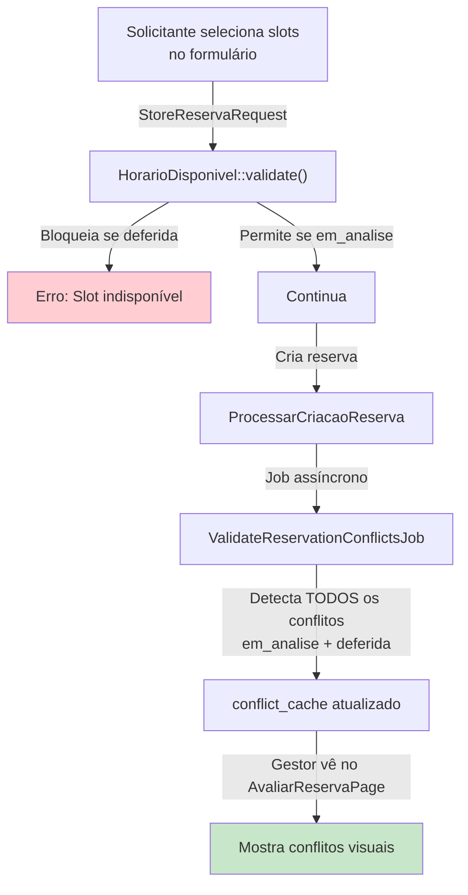

---

## 12. Árvore de Componentes Frontend (Fluxo de Reserva) {#frontend-tree}

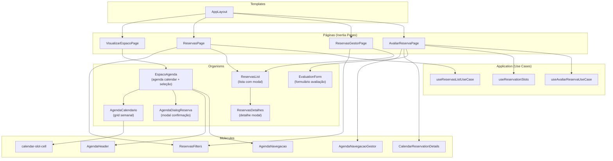

---

## 13. Camada de Arquitetura Backend {#arquitetura}

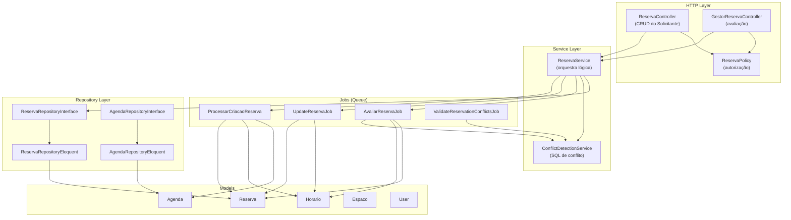

---

## 14. Gaps Identificados e Próximos Passos {#gaps}

Com base na análise do código, os seguintes pontos foram identificados como oportunidades de melhoria:

### 14.1 🔴 Crítico

| # | Gap | Descrição | Impacto |
|---|-----|-----------|---------|
| 1 | **Atualização automática da tela do Gestor** | A `AvaliarReservaPage` exibe loading para `validation_status = processing`, mas **não há polling nem evento Reverb** para recarregar automaticamente quando o `ValidateReservationConflictsJob` termina. O gestor precisa recarregar a página manualmente. | UX ruim em reservas grandes |
| 2 | **Update de reserva não regenera conflitos** | O `UpdateReservaJob` atualiza os horários mas **não dispara `ValidateReservationConflictsJob`** depois. O `conflict_cache` fica desatualizado após edição. | Dados de conflito inconsistentes |
| 3 | **Escopo de avaliação `recurring` ignora gestor** | No `AvaliarReservaJob` com `scope=recurring`, a propagação busca horários por `agenda_id` do gestor, mas **não restringe ao conjunto de agendas que o gestor gerencia** globalmente — apenas às da reserva. Se um espaço tiver múltiplos gestores, o primeiro a avaliar pode propagar para agendas de outro gestor. | Conflito de responsabilidade |

### 14.2 🟡 Melhorias Importantes

| # | Gap | Descrição |
|---|-----|-----------|
| 4 | **Notificação por e-mail sem template HTML** | O `BaseNotification.toMail()` usa `MailMessage` básico com texto puro. Não há template de e-mail customizado. |
| 5 | **Sem paginação no ReservasGestorPage** | A listagem de reservas do gestor usa paginação igual ao solicitante, mas a query não filtra por período — traz todas as reservas das agendas do gestor. Pode ser lento em produção. |
| 6 | **Política de update muito restritiva** | `ReservaPolicy.update()` bloqueia edição se qualquer horário tiver sido avaliado individualmente. Se apenas 1 de 50 horários foi avaliado, o solicitante perde a capacidade de editar os outros. |
| 7 | **Falta feedback em tempo real para o Solicitante** | Ao criar uma reserva, o solicitante vê apenas um flash "sendo processado". Não há indicador visual do progresso do job nem da validação de conflitos. |

### 14.3 🟢 Evoluções Futuras

| # | Sugestão | Descrição |
|---|----------|-----------|
| 8 | **Dashboard com métricas** | O `HomeController` e `HomeService` existem mas não têm dados consolidados de ocupação por espaço/turno. |
| 9 | **Aprovação parcial granular** | Atualmente o gestor pode deferir/indeferir por slot individual, mas o status `parcialmente_deferida` não tem fluxo claro de "o que fazer a seguir". |
| 10 | **Histórico de avaliações** | Não há log de quem avaliou o quê e quando além do `user_id` no `Horario`. Falta audit trail completo. |
| 11 | **Notificações em tempo real completas** | O Reverb está configurado e o `notification-dropdown.tsx` existe, mas os eventos de broadcast só notificam novas notificações — não recarregam dados das páginas automaticamente. |

---

## 14.4 Leitura Recomendada para Próximas Tarefas

- **Autorização e Políticas:** Ver `app/Policies/ReservaPolicy.php` para regras de acesso e `authorization-policies.md` para fluxo completo
- **Enums e Constantes:** Ver `app/Enums/SituacaoReserva/` para SituacaoReservaEnum e ModoArquivoEnum
- **Validações Detalhadas:** Ver `validation-rules.md` para rules customizadas (HorarioDisponivel, etc.)
- **Models e Relações:** Ver `models-business-rules.md` para detalhe de campos e relacionamentos

---

## 15. Referências de Código {#referências}

| Arquivo | Responsabilidade |
|---------|-----------------|
| [`ReservaController.php`](../app/Http/Controllers/ReservaController.php) | CRUD HTTP do solicitante |
| [`GestorReservaController.php`](../app/Http/Controllers/Gestor/GestorReservaController.php) | HTTP de avaliação do gestor |
| [`ReservaService.php`](../app/Services/ReservaService.php) | Orquestração e despacho de jobs |
| [`ProcessarCriacaoReserva.php`](../app/Jobs/ProcessarCriacaoReserva.php) | Job de criação assíncrona |
| [`UpdateReservaJob.php`](../app/Jobs/UpdateReservaJob.php) | Job de atualização assíncrona |
| [`AvaliarReservaJob.php`](../app/Jobs/AvaliarReservaJob.php) | Job de avaliação do gestor |
| [`ValidateReservationConflictsJob.php`](../app/Jobs/ValidateReservationConflictsJob.php) | Job de validação de conflitos |
| [`ConflictDetectionService.php`](../app/Services/ConflictDetectionService.php) | SQL de detecção de conflitos |
| [`ReservaPolicy.php`](../app/Policies/ReservaPolicy.php) | Autorização de ações na reserva |
| [`BaseNotification.php`](../app/Notifications/BaseNotification.php) | Base para todas as notificações |
| [`EspacoAgenda.tsx`](../resources/js/presentation/organisms/EspacoAgenda.tsx) | Organismo principal de seleção de slots |
| [`AgendaDialogReserva.tsx`](../resources/js/presentation/organisms/AgendaDialogReserva.tsx) | Modal de confirmação de reserva |
| [`AvaliarReservaPage.tsx`](../resources/js/presentation/pages/Reservas/Gestor/AvaliarReservaPage.tsx) | Página de avaliação do gestor |
| [`EvaluationForm.tsx`](../resources/js/presentation/organisms/EvaluationForm.tsx) | Formulário de avaliação |
