# UniEspaços — Core Workflow Report
> Generated: 2026-06-02 | Base para definição de próximos passos

---

## 1. Visão Geral do Sistema

UniEspaços é uma aplicação web de reserva de espaços acadêmicos com arquitetura full-stack desacoplada:

| Camada | Tecnologia |
|--------|-----------|
| Backend | Laravel 12.x (PHP) |
| Frontend | React 18 + Inertia.js (SPA) |
| Database | PostgreSQL 16 |
| Real-time | Laravel Reverb (WebSockets via Broadcast) |
| Queue | Laravel Queue (background jobs) |
| Auth / RBAC | Spatie Laravel Permission |

O **fluxo central** da aplicação tem dois atores principais:
- **Solicitante** — qualquer usuário autenticado que solicita a reserva de um espaço.
- **Gestor** — usuário com permissão `secao.gestao-reservas` que avalia as solicitações de reserva.

---

## 2. Modelo de Dados Central

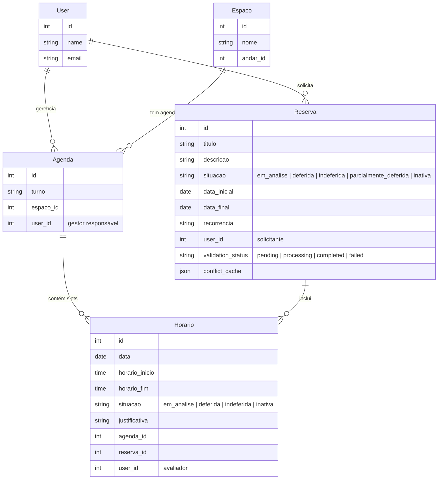

**Relação chave:** Uma `Reserva` agrupa vários `Horario`s. Cada `Horario` pertence a uma `Agenda` (que é vinculada a um `Espaco` e tem um `User` gestor). O status final da `Reserva` é **derivado** do conjunto de status dos seus `Horario`s.

---

## 3. Estados da Reserva

**Regra especial de auto-aprovação:** Se o solicitante for o único gestor de todos os espaços solicitados, a reserva já nasce com `situacao = deferida` (código em `ProcessarCriacaoReserva`).

---

## 4. Fluxo Completo de Criação de Reserva

### 4.1 Frontend — Seleção de Slots

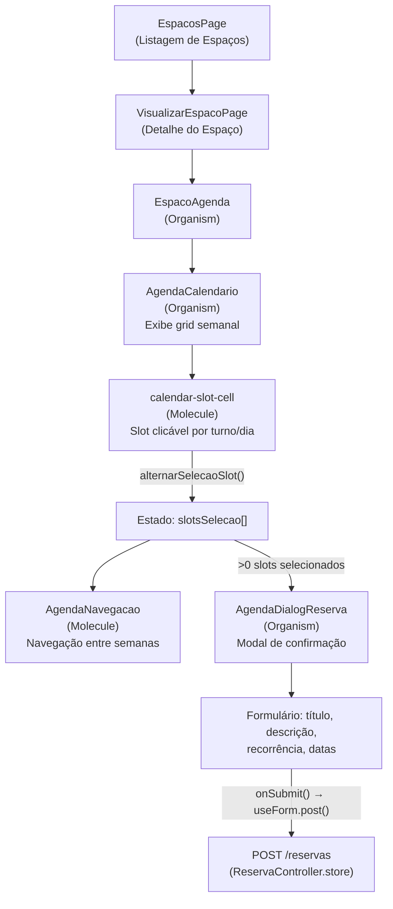

### 4.2 Backend — Processamento Assíncrono

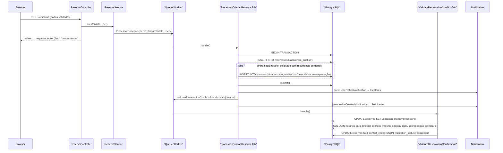

---

## 5. Fluxo de Avaliação pelo Gestor

### 5.1 Frontend — Tela de Avaliação

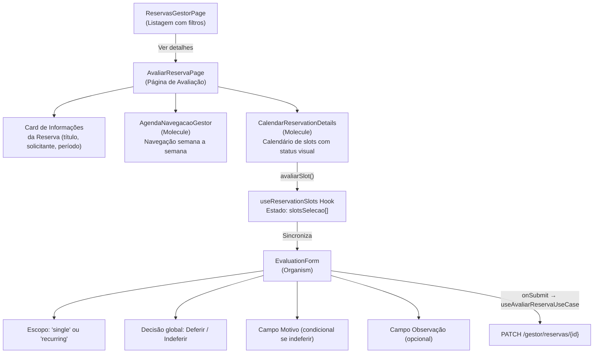

> **Nota importante:** O `AvaliarReservaPage` detecta `validation_status === 'processing'` ou `'pending'` e exibe um loading spinner em vez do formulário, evitando avaliação antes da validação de conflitos terminar.

### 5.2 Backend — Processamento da Avaliação

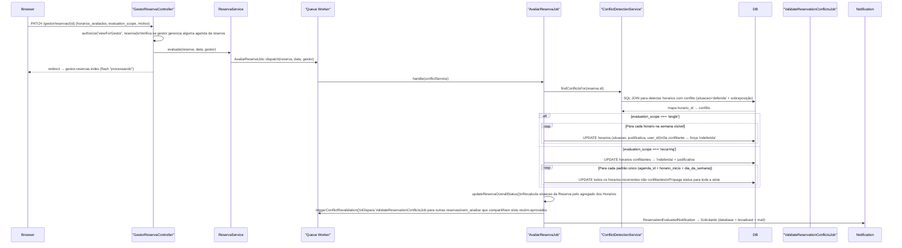

---

## 6. Regra de Status Agregado da Reserva

A situação final da `Reserva` é calculada em `AvaliarReservaJob::updateReservaOverallStatus()`:

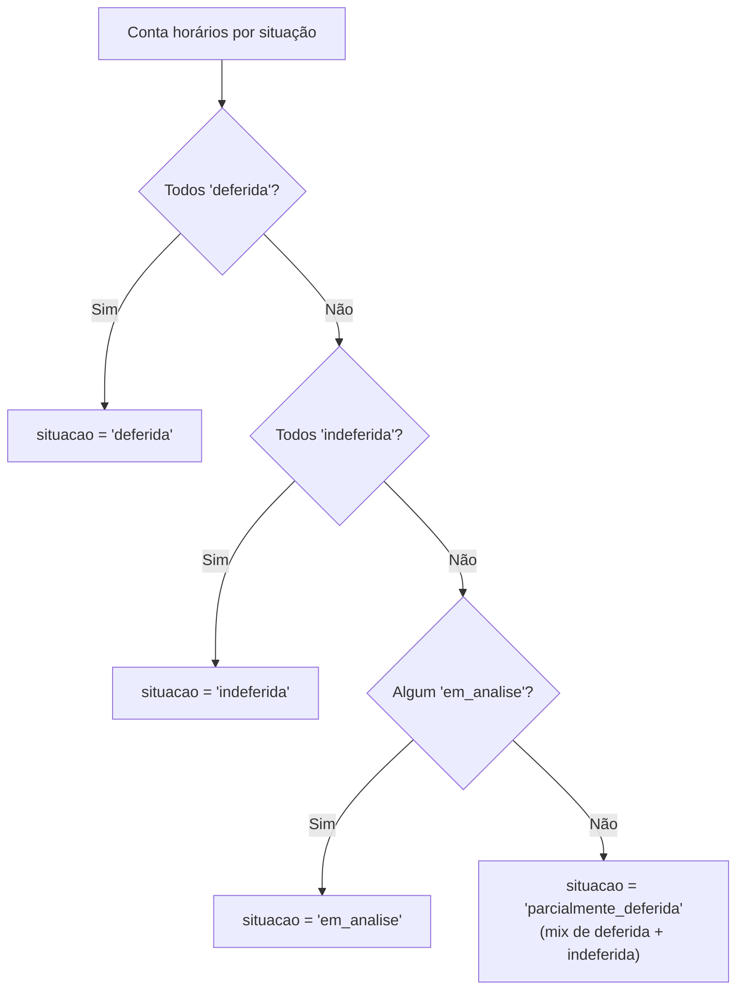

---

## 7. Cascata de Revalidação de Conflitos

Quando o gestor aprova horários (`deferida`), o sistema automaticamente revalida outras reservas pendentes que disputam os mesmos slots:

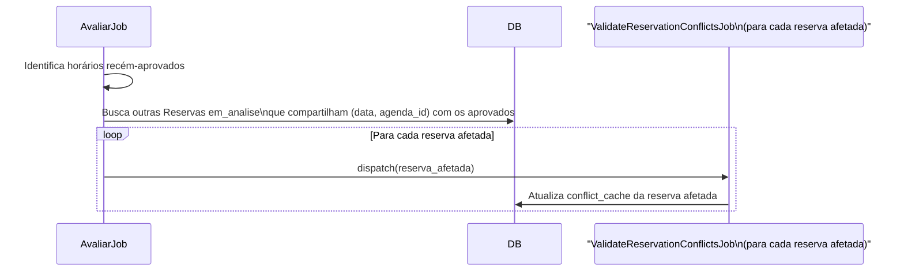

> **Objetivo:** Garantir que o gestor sempre veja o estado atual de conflitos ao avaliar uma reserva, mesmo que outra tenha sido aprovada após a submissão.

---

## 8. Fluxo de Cancelamento

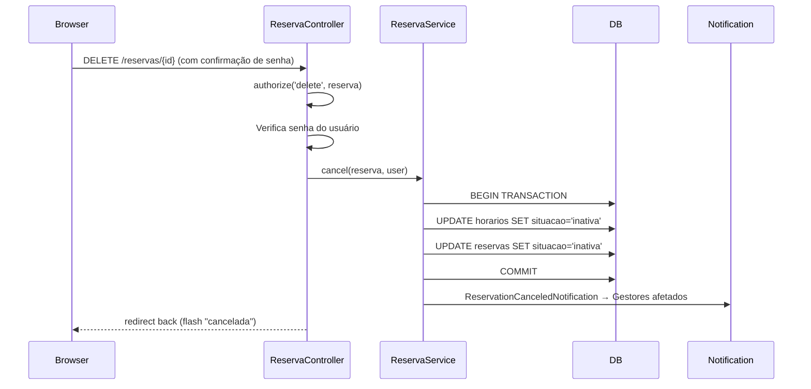

> **Nota:** O cancelamento é **síncrono** (não usa job/queue), diferente da criação e avaliação.

---

## 9. Sistema de Notificações

Todas as notificações estendem `BaseNotification` que implementa `ShouldQueue`:

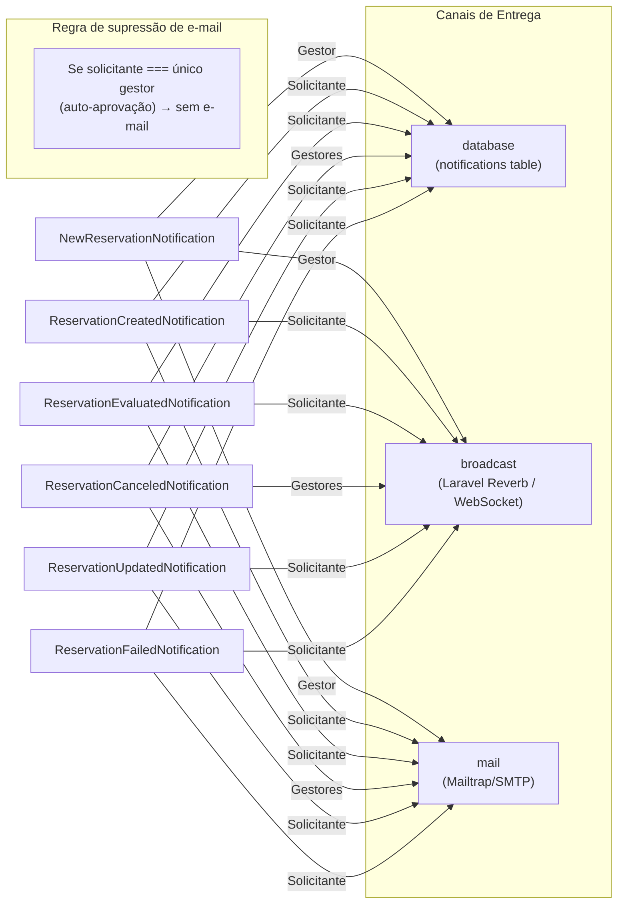

O canal `broadcast` usa **Laravel Reverb** (WebSocket) para entrega em tempo real via `notification-dropdown.tsx` no frontend.

---

## 10. Árvore de Componentes Frontend (Fluxo de Reserva)

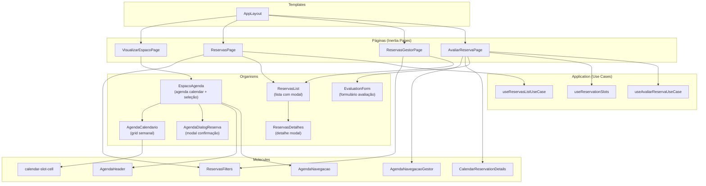

---

## 11. Camada de Arquitetura Backend

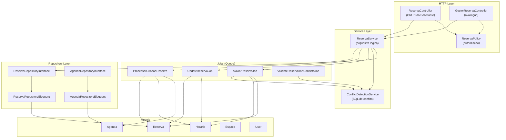

---

## 12. Gaps Identificados e Próximos Passos

Com base na análise do código, os seguintes pontos foram identificados como oportunidades de melhoria:

### 12.1 🔴 Crítico

| # | Gap | Descrição | Impacto |
|---|-----|-----------|---------|
| 1 | **Atualização automática da tela do Gestor** | A `AvaliarReservaPage` exibe loading para `validation_status = processing`, mas **não há polling nem evento Reverb** para recarregar automaticamente quando o `ValidateReservationConflictsJob` termina. O gestor precisa recarregar a página manualmente. | UX ruim em reservas grandes |
| 2 | **Update de reserva não regenera conflitos** | O `UpdateReservaJob` atualiza os horários mas **não dispara `ValidateReservationConflictsJob`** depois. O `conflict_cache` fica desatualizado após edição. | Dados de conflito inconsistentes |
| 3 | **Escopo de avaliação `recurring` ignora gestor** | No `AvaliarReservaJob` com `scope=recurring`, a propagação busca horários por `agenda_id` do gestor, mas **não restringe ao conjunto de agendas que o gestor gerencia** globalmente — apenas às da reserva. Se um espaço tiver múltiplos gestores, o primeiro a avaliar pode propagar para agendas de outro gestor. | Conflito de responsabilidade |

### 12.2 🟡 Melhorias Importantes

| # | Gap | Descrição |
|---|-----|-----------|
| 4 | **Notificação por e-mail sem template HTML** | O `BaseNotification.toMail()` usa `MailMessage` básico com texto puro. Não há template de e-mail customizado. |
| 5 | **Sem paginação no ReservasGestorPage** | A listagem de reservas do gestor usa paginação igual ao solicitante, mas a query não filtra por período — traz todas as reservas das agendas do gestor. Pode ser lento em produção. |
| 6 | **Política de update muito restritiva** | `ReservaPolicy.update()` bloqueia edição se qualquer horário tiver sido avaliado individualmente. Se apenas 1 de 50 horários foi avaliado, o solicitante perde a capacidade de editar os outros. |
| 7 | **Falta feedback em tempo real para o Solicitante** | Ao criar uma reserva, o solicitante vê apenas um flash "sendo processado". Não há indicador visual do progresso do job nem da validação de conflitos. |

### 12.3 🟢 Evoluções Futuras

| # | Sugestão | Descrição |
|---|----------|-----------|
| 8 | **Dashboard com métricas** | O `HomeController` e `HomeService` existem mas não têm dados consolidados de ocupação por espaço/turno. |
| 9 | **Aprovação parcial granular** | Atualmente o gestor pode deferir/indeferir por slot individual, mas o status `parcialmente_deferida` não tem fluxo claro de "o que fazer a seguir". |
| 10 | **Histórico de avaliações** | Não há log de quem avaliou o quê e quando além do `user_id` no `Horario`. Falta audit trail completo. |
| 11 | **Notificações em tempo real completas** | O Reverb está configurado e o `notification-dropdown.tsx` existe, mas os eventos de broadcast só notificam novas notificações — não recarregam dados das páginas automaticamente. |

---

## 13. Referências de Código

| Arquivo | Responsabilidade |
|---------|-----------------|
| [`ReservaController.php`](../app/Http/Controllers/ReservaController.php) | CRUD HTTP do solicitante |
| [`GestorReservaController.php`](../app/Http/Controllers/Gestor/GestorReservaController.php) | HTTP de avaliação do gestor |
| [`ReservaService.php`](../app/Services/ReservaService.php) | Orquestração e despacho de jobs |
| [`ProcessarCriacaoReserva.php`](../app/Jobs/ProcessarCriacaoReserva.php) | Job de criação assíncrona |
| [`UpdateReservaJob.php`](../app/Jobs/UpdateReservaJob.php) | Job de atualização assíncrona |
| [`AvaliarReservaJob.php`](../app/Jobs/AvaliarReservaJob.php) | Job de avaliação do gestor |
| [`ValidateReservationConflictsJob.php`](../app/Jobs/ValidateReservationConflictsJob.php) | Job de validação de conflitos |
| [`ConflictDetectionService.php`](../app/Services/ConflictDetectionService.php) | SQL de detecção de conflitos |
| [`ReservaPolicy.php`](../app/Policies/ReservaPolicy.php) | Autorização de ações na reserva |
| [`BaseNotification.php`](../app/Notifications/BaseNotification.php) | Base para todas as notificações |
| [`EspacoAgenda.tsx`](../resources/js/presentation/organisms/EspacoAgenda.tsx) | Organismo principal de seleção de slots |
| [`AgendaDialogReserva.tsx`](../resources/js/presentation/organisms/AgendaDialogReserva.tsx) | Modal de confirmação de reserva |
| [`AvaliarReservaPage.tsx`](../resources/js/presentation/pages/Reservas/Gestor/AvaliarReservaPage.tsx) | Página de avaliação do gestor |
| [`EvaluationForm.tsx`](../resources/js/presentation/organisms/EvaluationForm.tsx) | Formulário de avaliação |
