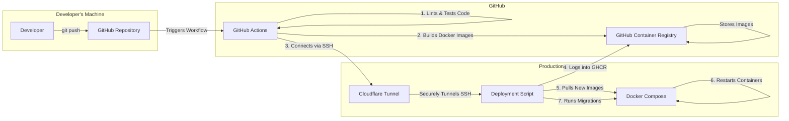

## UniEspaços System Architecture

This diagram illustrates the containerized architecture of the UniEspaços application, showing the flow of requests from the user to the various services.

``` mermaid
graph TD
    subgraph "User's Browser"
        U[User]
    end
    
    subgraph "Production Server (Docker)"
        N[Nginx Web Server]

        subgraph "PHP-FPM Services"
            A[App Container <br/>(Laravel)]
            Q[Queue Worker]
            R[Reverb <br/>(WebSocket Server)]
        end
        
        subgraph "Data Storage"
            DB[(PostgreSQL Database)]
        end
    end

    U -- "HTTPS Request (uniespacos.uesb.br)" --> N
    U -- "WSS WebSocket" --> N

    N -- "Forwards PHP requests" --> A
    N -- "Proxies WebSocket to /app" --> R

    A -- "Dispatches Jobs" --> Q
    A -- "Reads/Writes Data" --> DB
    A -- "Broadcasts Events" --> R

    Q -- "Processes Jobs" --> A
    Q -- "Reads/Writes Data" --> DB

    R -- "Receives Events" --> A
    R -- "Pushes Real-time Updates" --> U
```

## CI/CD Deployment Flow

This diagram shows the automated deployment pipeline triggered by a `git push`.


