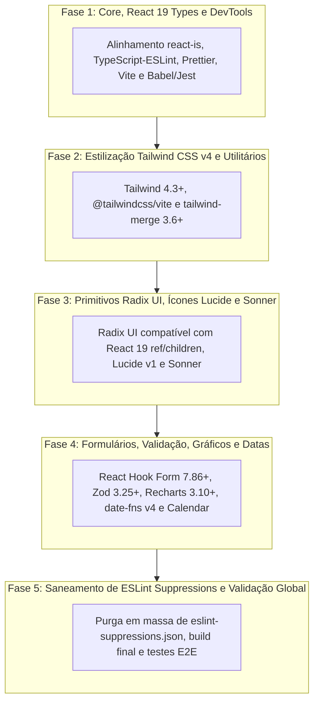

# Plano de Atualização do Ecossistema Frontend — UniEspaços

> **Documento de Controle Interno:** Guia mestre e índice operacional do plano de modernização e alinhamento de dependências de frontend do UniEspaços sob o **React 19**, **Tailwind CSS v4** e **Inertia.js v2**.  
> **Objetivo:** Trazer os pacotes de frontend para as versões mais recentes estáveis sem quebrar nenhuma regra de negócio, garantindo compatibilidade técnica de tipos, testes automatizados e purga sistemática de suppressions do ESLint (`eslint-suppressions.json`).  
> **Independência:** Estruturado em fases atômicas e progressivas para execução assistida sem saturação de contexto.

---

## 🎯 Visão Geral e Estratégia de Atualização

Durante a modernização de design do UniEspaços, o runtime foi elevado para o **React 19**, porém diversas dependências periféricas permaneceram em versões legadas (como `react-is` na v18, pacotes Radix UI anteriores às correções de tipagem do React 19, e `tailwind-merge` desatualizado para o Tailwind v4).

Este plano garante uma migração cirúrgica, dividida em 5 fases sequenciais:

---

## 🗂️ Estrutura das Fases e Pastas de Execução

| Fase | Diretório | Foco Principal | Severidade / Risco Mitigado | Documento de Instruções |
|---|---|---|---|---|
| **Fase 1** | `fase-01-core-types-build/` | Alinhamento do `react-is` (`^19.2.8`), atualização do ferramental de build (`vite`, `@vitejs/plugin-react`), linter (`typescript-eslint@8.68+`, `eslint@9.39+`) e limpeza de import indevido em `Dashboard.tsx` | 🟠 Médio (Incompatibilidade oculta de `react-is`) | [INSTRUCOES.md](./fase-01-core-types-build/INSTRUCOES.md) |
| **Fase 2** | `fase-02-tailwind-styling/` | Atualização do `tailwindcss` (`4.3.3`), `@tailwindcss/vite` e `tailwind-merge` (`3.6.0`) para compatibilidade perfeita com classes dinâmicas do `@theme` nativo | 🟡 Baixo (Conflitos de classes utilitárias) | [INSTRUCOES.md](./fase-02-tailwind-styling/INSTRUCOES.md) |
| **Fase 3** | `fase-03-radix-ui-lucide-sonner/` | Elevação de todos os 20 pacotes `@radix-ui/react-*` para versões com suporte pleno aos novos contratos de `ref` e `children` do React 19, `lucide-react` (`1.34.0`) e `sonner` | 🟠 Médio (Tipagens de refs e acessibilidade de ícones) | [INSTRUCOES.md](./fase-03-radix-ui-lucide-sonner/INSTRUCOES.md) |
| **Fase 4** | `fase-04-forms-dates-charts/` | Atualização de `react-hook-form` (`7.86.0`), `@hookform/resolvers` (`5.9.1`), `zod`, `recharts` (`3.10.1`), `date-fns` (`4.4.0`) e harmonização dos imports de locale `ptBR` | 🔴 Alto (Formulários, renderização de gráficos e datas de reservas) | [INSTRUCOES.md](./fase-04-forms-dates-charts/INSTRUCOES.md) |
| **Fase 5** | `fase-05-purga-eslint-suppressions/` | Recálculo e purga estrita de entradas em `eslint-suppressions.json`, validação de zero alertas com `npx eslint resources/js`, `npm run build` e suíte completa de testes | 🟡 Baixo / Qualidade de Código | [INSTRUCOES.md](./fase-05-purga-eslint-suppressions/INSTRUCOES.md) |

---

## 📋 Protocolo Obrigatório para os Executores

1. **Garantia de Regras de Negócio:** Nenhuma regra de negócio em controllers, hooks, formulários ou serviços deve ser alterada. As modificações devem se ater estritamente a ajustes técnicos de tipos, assinaturas de componentes, imports padronizados e compatibilidade de dependências.
2. **Execução Atômica:** Execute tarefa por tarefa (`T1.1`, `T1.2`...), validando a cada passo com `npx tsc --noEmit` e `npx jest`.
3. **Validação Contínua Obrigatória:**
   - Checagem estrita de tipos: `npx tsc --noEmit`
   - Testes unitários do frontend: `npx jest` (todos os 170 testes devem passar)
   - Testes do backend (zero regressão): `docker exec -e APP_ENV=testing uniespacos-workspace-1 php artisan test`
   - Linter e formatação: `npx eslint resources/js` e `npm run format:check`
4. **Relatório de Conclusão:** Ao terminar qualquer fase, crie o arquivo `RELATORIO_IMPLEMENTACAO.md` dentro da pasta da respectiva fase.

---

## 🔁 Protocolo de Transição entre Sessões (Pre-Prompts)

Para manter o contexto limpo e focado, execute cada fase em uma sessão independente:
1. Copie o **Pre-Prompt** da fase correspondente.
2. Cole no chat do agente.
3. O agente executa as tarefas atômicas, roda a validação completa, preenche o relatório de implementação e gera o Pre-Prompt da fase seguinte.
