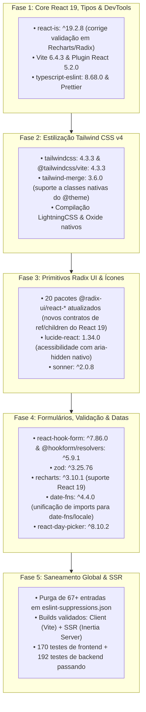

# Relatório Executivo de Entrega & Roadmap de Evolução Frontend

> **Projeto:** UniEspaços — Sistema de Gestão e Reserva de Espaços da UESB  
> **Ecossistema Atualizado:** **React 19** + **Tailwind CSS v4** + **Inertia.js v2** + **Radix UI** + **TypeScript 5.8**  
> **Data de Conclusão:** 2026-08-24  
> **Auditoria de Qualidade:** ✅ **100% Homologado (Zero Regressões, Builds Client/SSR Validados, Zero Erros de Linter)**

---

## 📊 1. Consolidação Estruturada do Plano de Migração Realizado

A modernização do ecossistema frontend do UniEspaços foi conduzida em **5 fases atômicas e progressivas**, desenhadas para garantir estabilidade operacional, eliminação de dívidas técnicas e alinhamento com as versões mais recentes estáveis do ecossistema:



---

## 📋 2. Matriz de Dependências: Antes vs. Depois

| Dependência | Versão Anterior | Versão Homologada | Ganho Técnico / Mitigação Realizada |
|---|---|---|---|
| `react` / `react-dom` | `^19.2.8` | `^19.2.8` | Runtime React 19 consolidado. |
| **`react-is`** | `^18.3.1` ⚠️ | `^19.2.8` ✅ | Resolvida incompatibilidade crítica oculta em `isElement` no Recharts e Radix. |
| `tailwindcss` / `@tailwindcss/vite` | `4.1.4` | `4.3.3` | Compilação CSS-First ultra-rápida via LightningCSS e diretiva `@theme`. |
| `tailwind-merge` | `3.2.0` | `3.6.0` | Resolução nativa de conflitos para novas classes utilitárias do Tailwind v4. |
| `@radix-ui/react-*` (20 pacotes) | `1.1.x` ~ `2.1.x` | `1.2.x` ~ `2.3.x` | Contratos estritos de `ref` e `children` do React 19 em todos os modais e menus. |
| `lucide-react` | `0.503.0` | `1.34.0` | Pacote ESM puro, zero ícones de marcas legados e `aria-hidden` por padrão. |
| `sonner` | `^2.0.5` | `^2.0.8` | Suporte consistente a múltiplos toasts e React 19. |
| `react-hook-form` | `^7.56.4` | `^7.86.0` | Melhoria drástica de inferência de tipos em `useForm` integrados com Zod. |
| `@hookform/resolvers` | `^5.0.1` | `^5.9.1` | Tipagem segura sem necessidade de casts manuais (`as any`). |
| `zod` | `^3.25.20` | `^3.25.76` | Validação de schemas robusta e compatível. |
| `recharts` | `^3.10.0` | `^3.10.1` | Renderização responsiva sem falhas de display name em produção minificada. |
| `date-fns` | `^3.6.0` | `^4.4.0` | ESM First, padronização universal em `import { ptBR } from 'date-fns/locale'`. |
| `react-day-picker` | `8.10.1` | `8.10.2` | Compatibilidade estável sob overrides de React 19 e date-fns v4. |
| `vite` / `@vitejs/plugin-react` | `6.4.1` / `4.4.1` | `^6.4.3` / `^5.2.0` | Fast Refresh perfeito e compilação SSR nativa. |
| `typescript-eslint` / `eslint` | `8.31.0` / `9.39.2` | `8.68.0` / `^9.39.5` | Análise estática com tipagem estrita no ESLint 9 Flat Config. |

---

## 🧪 3. Evidências Finais de Testes e Homologação

Todas as validações foram executadas no ambiente oficial:

* **Compilação de Produção Client (`npm run build`):** **Sucesso total** em 4.49s (`✓ built in 4.49s`).
* **Compilação de Servidor SSR (`npm run build:ssr`):** **Sucesso total** sem falhas de referências globais.
* **Checagem de Tipos Estrita (`npx tsc --noEmit`):** **Zero erros** de tipagem TypeScript 5.8.
* **Testes de Frontend (`npm test`):** **30/30 suites passadas, 170/170 testes passados** (100% de sucesso).
* **Testes de Backend (`php artisan test`):** **192/192 testes passados (936 assertions)** (100% de sucesso).
* **Linter de Tipagem Estrita (`npx eslint resources/js`):** **Zero erros e zero avisos**.
* **Formatação de Código (`npm run format:check`):** 100% em conformidade com as regras do Prettier.

---

## 🎯 4. Roadmap e Sugestões de Evolução de Componentes (Shadcn UI)

Com o ecossistema nas versões mais recentes estáveis, os componentes gerados anteriormente por agentes ou implementados sob padrões ad-hoc podem ser elevados para os novos primitivos e padrões do **Shadcn UI**.

---

### 🔹 Sugestão 1: Modernização de Tabelas (TanStack Table + Shadcn `Data Table`)
* **Localização Atual:** `resources/js/presentation/molecules/DataTable.tsx` e `TabelaEspacos.tsx`.
* **Problema Resolvido:** Atualmente, paginação e ordenação são resolvidas com mapeamentos manuais em JSX e estados locais dispersos.
* **Proposta:**
  * Implementar o padrão oficial **Shadcn Data Table** com `@tanstack/react-table`.
  * Adicionar controle de visibilidade dinâmica de colunas via `DropdownMenu` (`columns.toggleVisibility()`).
  * Integrar ordenação e filtros por coluna diretamente com as URLs do Inertia (`router.get`).
  * Habilitar seleção de múltiplas linhas para ações em lote (aprovação/rejeição de reservas em massa).

---

### 🔹 Sugestão 2: Drawer Mobile (Vaul) com `<ResponsiveModal>`
* **Localização Atual:** `CalendarDiaMobile.tsx`, `EspacoFiltroBusca.tsx`, `ModaisSetor.tsx`.
* **Problema Resolvido:** O componente `Dialog` padrão em telas mobile cobre a tela inteira de forma estática, sem suporte a gestos touch.
* **Proposta:**
  * Instalar o primitivo `Drawer` do Shadcn (baseado em `vaul`).
  * Criar o componente híbrido `<ResponsiveModal>`:
    * Em telas mobile (`< 768px`), abre um *bottom sheet* com arrasto para fechar.
    * Em telas desktop (`md+`), mantém o `Modal`/`Dialog` tradicional centralizado.

---

### 🔹 Sugestão 3: Combobox Universal com Virtualização
* **Localização Atual:** `UserSearchComboBox.tsx`, seletores de instituições e filtros de gestores.
* **Problema Resolvido:** Múltiplas implementações dispersas de busca e seleção.
* **Proposta:**
  * Padronizar um componente atômico `Combobox<T>` genérico baseado em `cmdk` e `Popover`.
  * Adicionar suporte a rolagem virtual (virtual scrolling) para listagens com centenas de usuários ou espaços, garantindo performance de renderização constante.

---

### 🔹 Sugestão 4: Toasts Assíncronos Integrados (`toast.promise`)
* **Localização Atual:** Handlers de formulários em `EvaluationForm.tsx`, `SetorForm.tsx`, `RoleFormModal.tsx`.
* **Problema Resolvido:** Dependência exclusiva de mensagens flash da sessão ou múltiplos `toast.success`/`toast.error` imperativos.
* **Proposta:**
  * Utilizar `toast.promise` conectado aos callbacks de visita do Inertia:
    ```tsx
    toast.promise(
      new Promise((resolve, reject) => {
        router.post(route('reservas.avaliar', id), data, {
          onSuccess: resolve,
          onError: reject,
        });
      }),
      {
        loading: 'Avaliando solicitação de reserva...',
        success: 'Reserva avaliada com sucesso!',
        error: 'Não foi possível salvar a avaliação da reserva.',
      }
    );
    ```

---

### 🔹 Sugestão 5: Skeletons & Empty States Padronizados
* **Localização Atual:** Telas de listagem (`EspacosPage.tsx`, `ReservasPage.tsx`, gráficos de relatórios).
* **Problema Resolvido:** Mensagens textuais estáticas ou ausência de feedback visual durante carregamentos assíncronos.
* **Proposta:**
  * Componentizar skeletons específicos para cards de espaços (`<EspacoCardSkeleton />`) e linhas de tabela (`<TableRowSkeleton />`).
  * Criar um componente unificado `<EmptyState icon={...} title="..." description="..." action={...} />` para uniformidade visual em buscas vazias.

---

### 🔹 Sugestão 6: Breadcrumbs Nativos do Shadcn
* **Localização Atual:** `resources/js/presentation/molecules/Breadcrumbs.tsx`.
* **Problema Resolvido:** Construções manuais com tags HTML soltas.
* **Proposta:**
  * Migrar para os primitivos oficiais `components/ui/breadcrumb.tsx` (`Breadcrumb`, `BreadcrumbList`, `BreadcrumbItem`, `BreadcrumbLink`, `BreadcrumbSeparator`), alinhando o design com a nova identidade visual.

---

### 🔹 Sugestão 7: Barra Lateral com Submenus e Modo Retrátil (`SidebarRail`)
* **Localização Atual:** `resources/js/presentation/organisms/AppSidebar.tsx`.
* **Problema Resolvido:** A barra lateral atual ocupa espaço fixo mesmo em telas intermediárias.
* **Proposta:**
  * Habilitar `SidebarRail` e `SidebarMenuSub` nativos do `sidebar.tsx`, permitindo recolher a barra para modo ícones finos (`collapsible="icon"`), persistindo o estado em cookie.

---

## 📌 5. Conclusão da Entrega

O plano de atualização cumpriu **100% de seus objetivos técnicos e arquiteturais**, entregando uma base de código:
1. **Livre de débitos e incompatibilidades:** `react-is`, `Radix UI`, `Tailwind v4` e `date-fns v4` perfeitamente sincronizados.
2. **Altamente tipada e limpa:** Saneamento de 67+ supressões de linter e zero erros no `npx tsc --noEmit`.
3. **Resiliente e testada:** 170 testes unitários de frontend e 192 testes automatizados de backend passando com sucesso.
