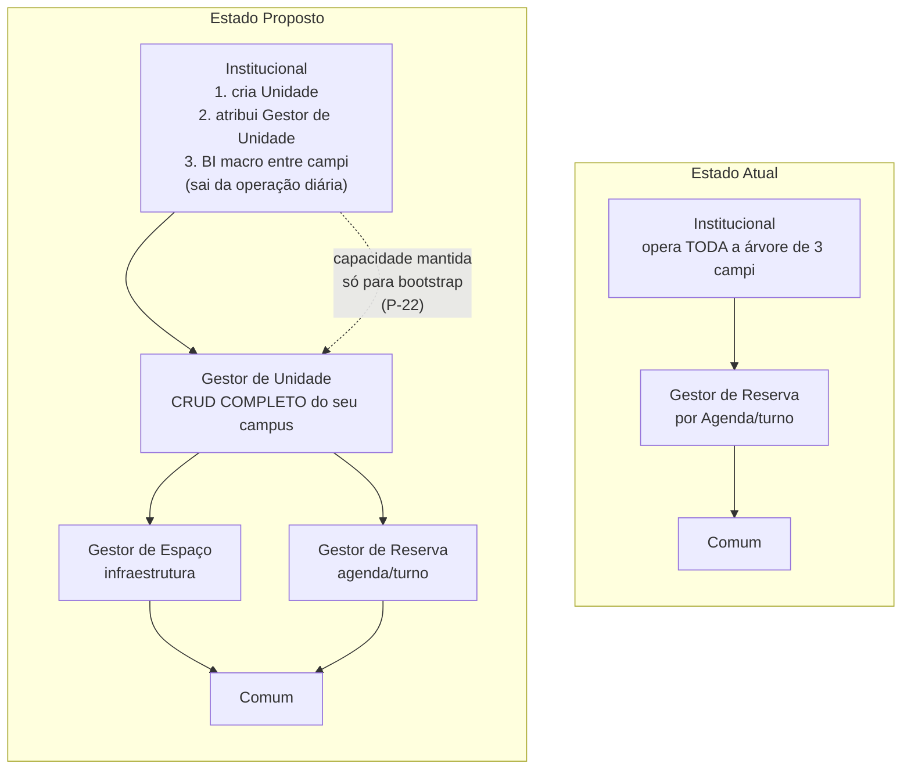
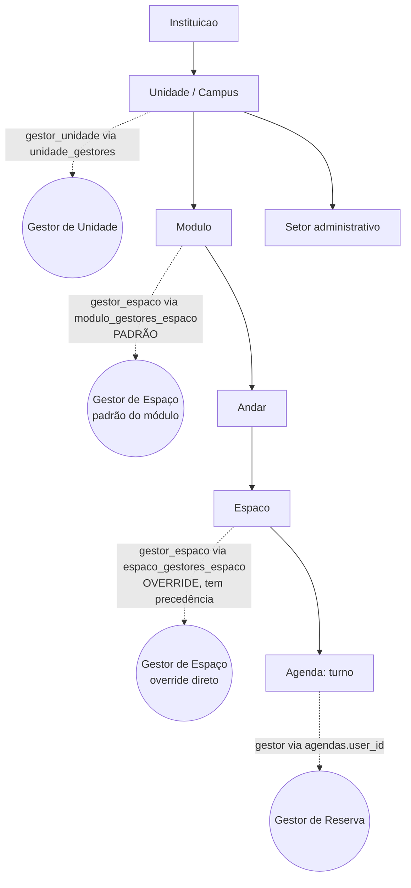
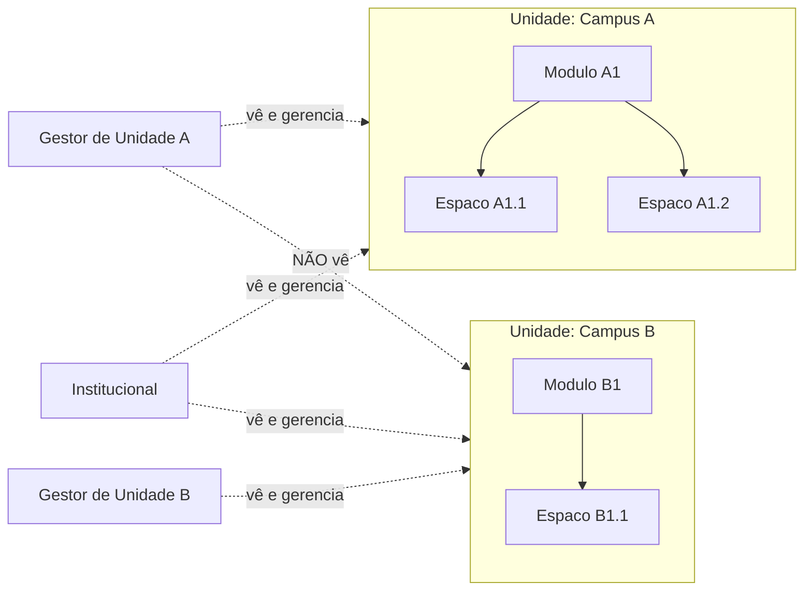
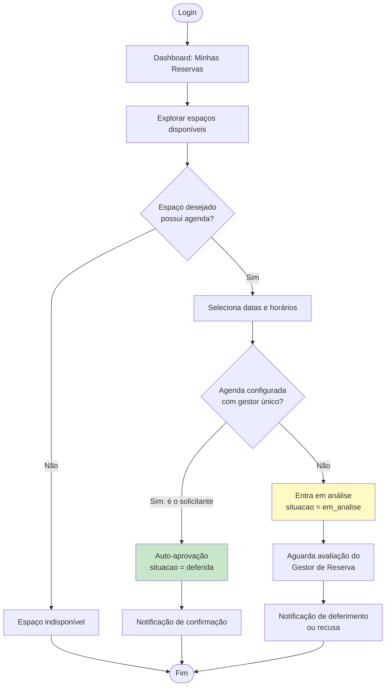
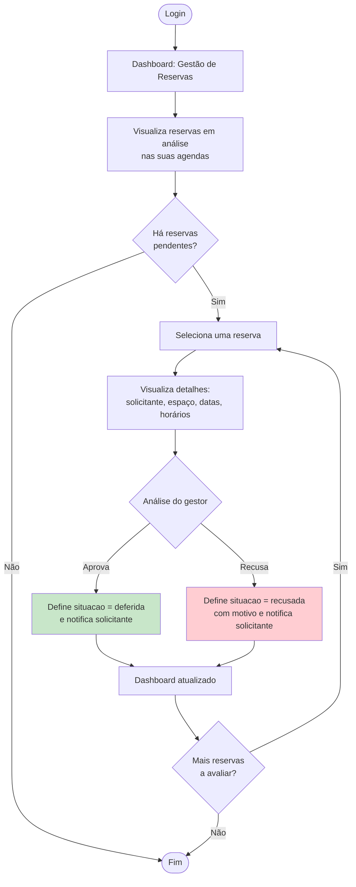
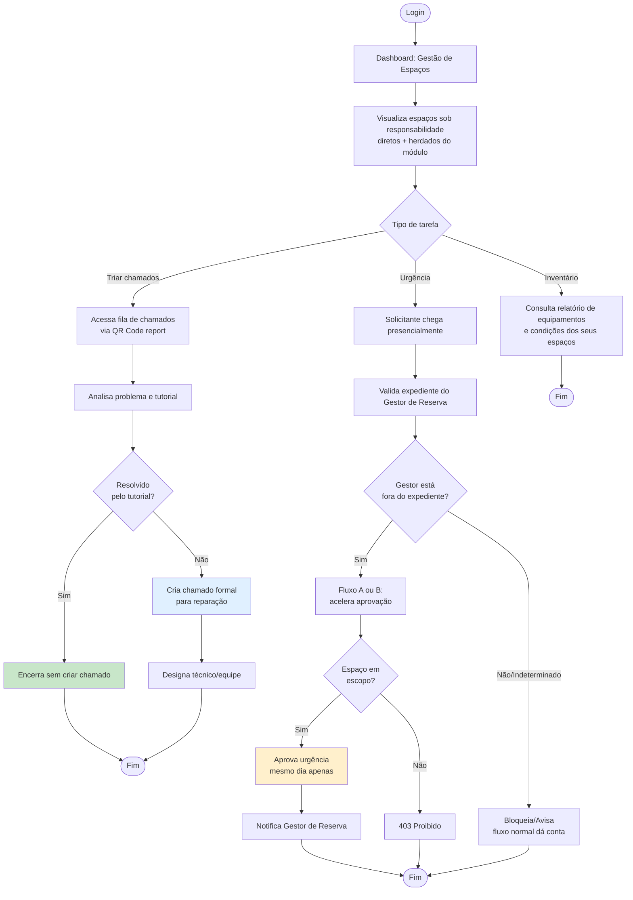
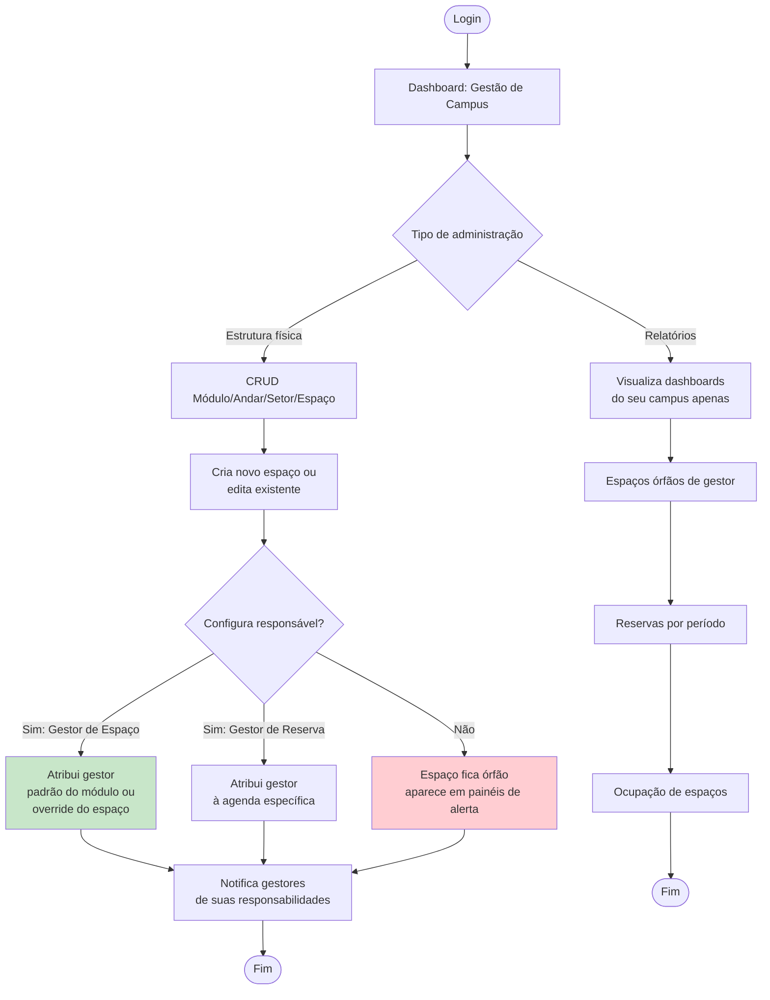

# 01 — Fluxos de Jornada por Ator

Este documento descreve a jornada típica de cada um dos 5 atores do UniEspaços na v2.0: **login, dashboard, ações principais**. Compreender a experiência de cada ator é essencial para alinhar o design da interface e a priorização de features.

---

## Estrutura Organizacional e Governança

Antes de descrever as jornadas individuais, aqui estão os três diagramas que ilustram como os atores se relacionam, se localizam na hierarquia e quais dados cada um enxerga.

### Hierarquia de Governança — Atual vs. Proposta



A mudança central da v2.0 é que o **Institucional recua para bootstrap e analytics**, e o **Gestor de Unidade assume o CRUD completo do seu campus**. A seta pontilhada representa a capacidade técnica preservada (não revogada) para configurar uma Unidade que ainda não tem gestor designado.

### Árvore Territorial e Organizacional — Onde Cada Ator Se Encaixa



A infraestrutura física é organizada em camadas: **Unidade → Módulo → Andar → Espaço**. Cada ator tem um ponto de encaixe específico, com possibilidade de **override** (um espaço individual pode ter seu próprio Gestor de Espaço, mesmo que o módulo tenha um padrão).

### Escopo de Visibilidade — Quem Vê o Quê



**Ponto crítico de desenho:** o Gestor de Unidade A não enxerga Campus B — nem estrutura, nem reservas, nem relatórios. Cada ator tem seu escopo bem delimitado.

---

## Jornadas por Ator

### Comum

O usuário comum é quem **solicita reservas**. Possui o papel mínimo no sistema e pode acumular outros papéis (Gestor de Reserva, Gestor de Espaço, etc.), mas a jornada de Comum descreve o caminho puro de solicitação.

#### Fluxo Típico — Solicitar Reserva



#### Ações Disponíveis

1. **Solicitar reserva** — explorar espaços, selecionar data/hora, submeter
2. **Visualizar minhas reservas** — ver status (deferida, recusada, em análise, cancelada)
3. **Avaliar/relatar reserva** — dar feedback após o evento
4. **Reportar problema** — escanear QR Code no espaço e descrever issue (infraestrutura)
5. **Visualizar agenda pública** de espaços (sem necessidade de login)

---

### Gestor de Reserva

O **Gestor de Reserva** é responsável por **avaliar e deferir/recusar reservas** em suas agendas designadas. É um operador ativo do fluxo de aprovação normal.

#### Fluxo Típico — Avaliar Reservas



#### Ações Disponíveis

1. **Avaliar reservas em análise** — as que estão em `em_analise` nas suas agendas
2. **Deferir reserva** — mudar situação para `deferida` e notificar solicitante
3. **Recusar reserva** — mudar situação para `recusada`, incluir motivo
4. **Ver relatório de reservas** — filtrado por agenda/período (suas agendas apenas)
5. **Visualizar e gerenciar sua(s) agenda(s)** — criar/editar turnos (ação administrativa, junto com Gestor de Unidade)

**Nota especial de urgência:** o Gestor de Reserva recebe uma **notificação obrigatória** quando o Gestor de Espaço aprova uma reserva em regime de urgência (mesmo dia, seus espaços). Ver documento `./03-diagramas-de-sequencia.md` para o fluxo completo de urgência.

---

### Gestor de Espaço

O **Gestor de Espaço** é responsável pela **manutenção e infraestrutura dos espaços** — equipamentos, mobiliário, condições de uso. Tem um caminho de exceção para **aprovação de urgência**, além do fluxo normal.

#### Fluxo Típico — Gerenciar Infraestrutura



#### Ações Disponíveis

1. **Visualizar espaços gerados** — todos os seus (diretos + padrão do módulo)
2. **Receber e triar chamados** — via QR Code, com suporte a tutoriais assistidos
3. **Criar chamado formal** — quando o tutorial não resolve
4. **Consultar inventário** — relatório de equipamentos dos seus espaços
5. **Aprovar reserva em urgência** (caminho de exceção):
   - **Cenário:** solicitante chega presencialmente fora do expediente do Gestor de Reserva
   - **Validações:** espaço em escopo, horário livre (sem conflito com deferida), mesmo dia apenas
   - **Resultado:** aprovação direta + notificação ao Gestor de Reserva titular
   - **Limite:** nenhum limite de quantidade por enquanto, mas cada aprovação é auditável

**Ponto crítico:** o Gestor de Espaço **NÃO** participa do fluxo normal de aprovação — apenas da exceção de urgência. Não pode recusar reservas, não vê `em_analise`. O fluxo normal continua exclusividade do Gestor de Reserva.

---

### Gestor de Unidade

O **Gestor de Unidade** é o **operador administrativo pleno do seu campus** — cria e gerencia a estrutura física inteira (módulos, andares, setores, espaços) e atribui gestores (de reserva e de espaço).

#### Fluxo Típico — Administrar Campus



#### Ações Disponíveis

1. **CRUD completo de Módulo, Andar, Setor, Espaço** — escopado ao seu campus
2. **Atribuir/remover Gestor de Reserva** — vincula usuário à(s) agenda(s) via `Agenda.user_id`
3. **Atribuir/remover Gestor de Espaço** — padrão do módulo ou override do espaço
4. **Visualizar espaços órfãos** — lista detalhada (quais espaços, para ação imediata)
5. **Acessar relatórios do campus** — ocupação, reservas, inventário
6. **Editar expediente de setores** — se designado coordenador (P-23) — horários e exceções

**Nota crítica sobre reservas:** o Gestor de Unidade **NUNCA** participa do fluxo de aprovação de reservas — nem no normal, nem na urgência. `ReservaPolicy` não menciona `gestor_unidade` em nenhum ponto. Sua responsabilidade é garantir que a estrutura (espaços e gestores) esteja bem configurada para que o fluxo de reserva funcione.

---

### Institucional

O **Institucional** é o **ator de bootstrap e analytics macro** — cria Unidades, atribui Gestores de Unidade, e monitora a saúde operacional entre campi.

#### Fluxo Típico — Governança Macro

```mermaid
flowchart TD
    A([Login]) --> B[Dashboard: Visão Institucional]
    B --> C{Tipo de ação}
    
    C -->|Bootstrap de campus| D[Cria nova Unidade]
    D --> D1[Designa Gestor(es) de Unidade]
    D1 --> D2[Define rótulo customizado<br/>ex: 'Prefeitura de Campus']
    D2 --> D3{Gestor designado?}
    D3 -->|Sim| D4[Notifica novo gestor<br/>de suas responsabilidades]
    D3 -->|Não| D5[Institucional mantém<br/>capacidade técnica para bootstrap]
    D4 --> Z1([Fim])
    D5 --> Z1
    
    C -->|Analytics macro| E[Visualiza BI entre campi]
    E --> E1[Total de espaços por campus]
    E1 --> E2[Espaços órfãos por campus<br/>indicador agregado, não lista]
    E2 --> E3[Gestores de Unidade designados]
    E3 --> E4[Histórico de configurações]
    E4 --> Z2([Fim])
    
    C -->|Usuários/Roles| F[Gerencia roles e permissions globais]
    F --> F1[Atribui papéis a usuários]
    F1 --> Z3([Fim])
    
    style D1 fill:#c8e6c9
    style E2 fill:#e0f0ff
```

#### Ações Disponíveis

1. **CRUD de Unidade** — criar, editar, excluir campi
2. **Atribuir Gestor(es) de Unidade** — N:N, múltiplos gestores permitidos
3. **Visualizar BI macro** — indicadores agregados entre campi (não lista item a item)
4. **Visualizar órfãos em formato analítico** — quantos espaços por campus, não quais específicos
5. **Gerenciar Usuários, Roles e Permissions** — visão global
6. **Manter capacidade de CRUD** em Módulo/Andar/Setor/Espaço — para bootstrap de unidades que ainda não têm Gestor de Unidade designado (P-22)

**Nota de transição:** o Institucional **sai da operação diária** — não é mais quem cria/edita espaços rotineiramente. Mas não perde a capacidade técnica, que é preservada para situações de bootstrap ou exceção.

---

## Síntese: Matriz de Ações Consolidada

| Ação | Comum | Gestor de Reserva | Gestor de Espaço | Gestor de Unidade | Institucional |
|---|:---:|:---:|:---:|:---:|:---:|
| Solicitar reserva | ✅ | ✅ | ✅ | ✅ | ✅ |
| Avaliar reserva — fluxo normal | ❌ | ✅ (suas agendas) | ❌ | ❌ | ❌ |
| Aprovar reserva — urgência (mesmo dia, seus espaços) | ❌ | — | ✅ | ❌ | ❌ |
| Criar reserva em nome de terceiro (walk-in urgência) | ❌ | ❌ | ✅ (urgência) | ❌ | ❌ |
| Triar chamados de infraestrutura | ❌ | ❌ | ✅ (seus espaços) | ❌ | ❌ |
| Ver órfãos — lista detalhada | ❌ | ❌ | ❌ | ✅ (seu campus) | ❌ |
| Ver órfãos — indicador analítico | ❌ | ❌ | ❌ | ✅ (seu campus) | ✅ (todos os campi) |
| CRUD Módulo/Andar/Setor/Espaço | ❌ | ❌ | ❌ | ✅ (seu campus) | ✅ (bootstrap/exceção) |
| Atribuir Gestor de Reserva | ❌ | ❌ | ❌ | ✅ (seu campus) | ✅ |
| Atribuir Gestor de Espaço | ❌ | ❌ | ❌ | ✅ (seu campus) | ✅ |
| CRUD de Unidade | ❌ | ❌ | ❌ | ❌ | ✅ |
| Atribuir Gestor de Unidade | ❌ | ❌ | ❌ | ❌ | ✅ |

---

## Próximas Leituras

- **`./02-diagramas-de-fluxo.md`** — diagramas de sequência para fluxos complexos (urgência, QR Code, walk-in)
- **`./03-diagramas-de-sequencia.md`** — interação detalhada entre Controllers, Services, Repositories e banco de dados
- **`../01-visao-geral-e-escopo/`** — contexto e decisões que moldaram estes atores
