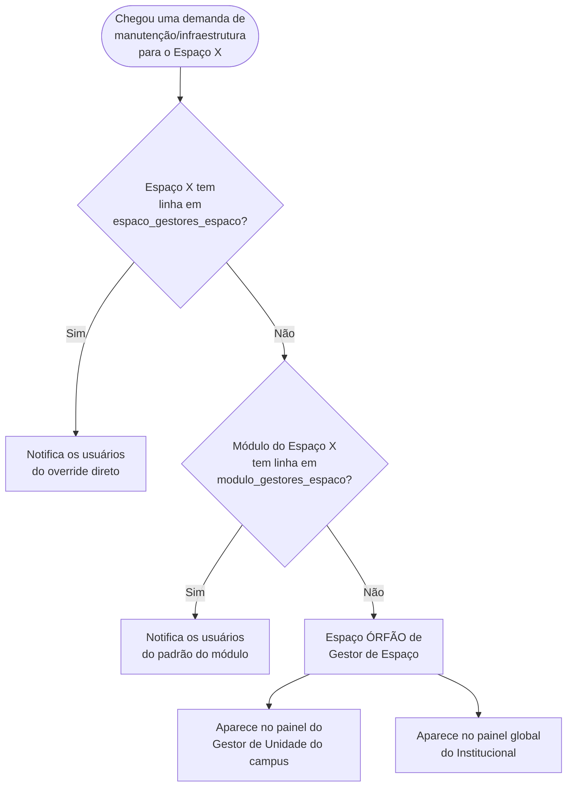
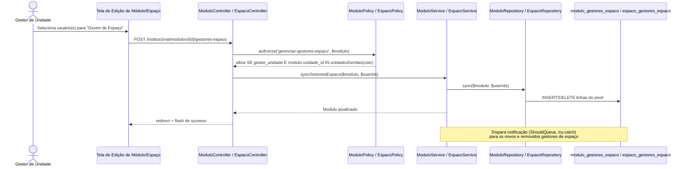
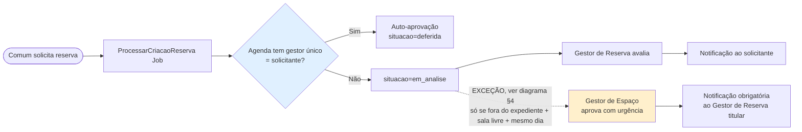
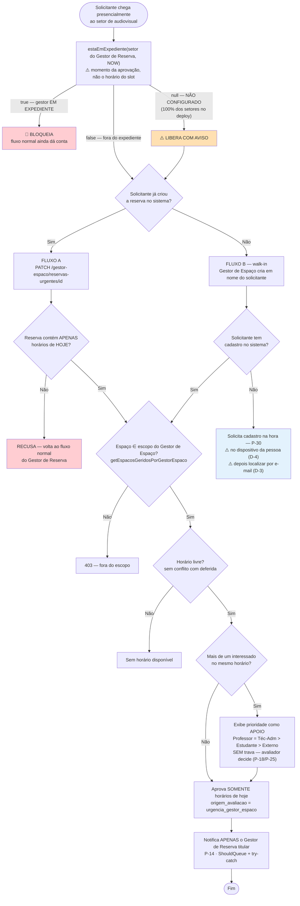
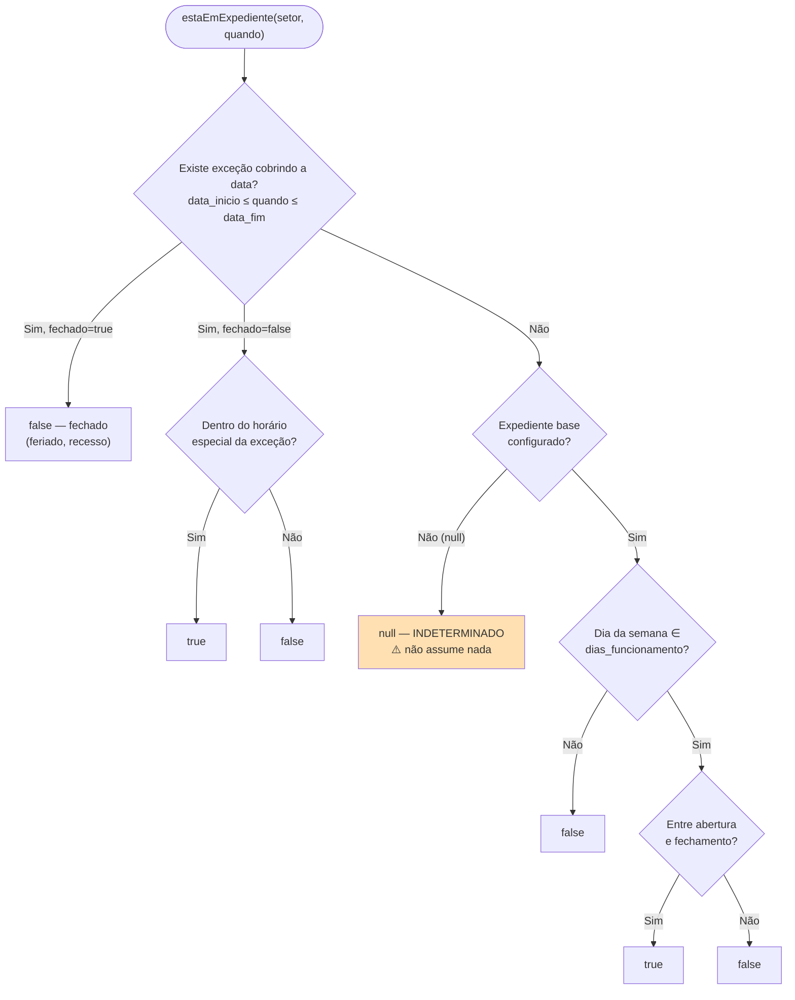
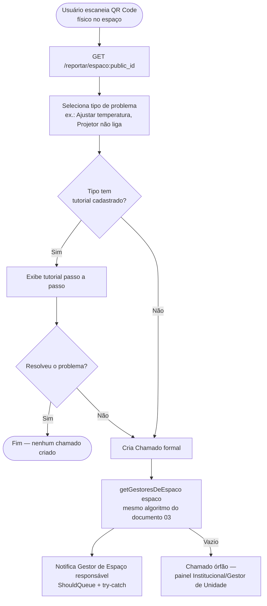
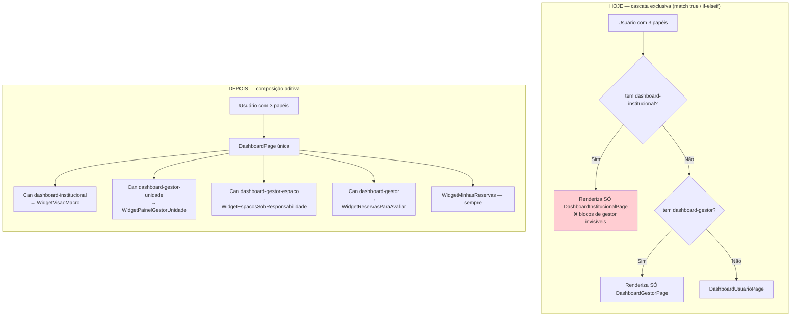

# 03 — Diagramas de Sequência e Fluxogramas

Documento que reúne os diagramas de interação entre camadas (Controller → Policy → Service → Repository → DB) e fluxogramas de decisão complexa da arquitetura v2.0 do UniEspaços.

---

## 1. Fluxograma de Resolução de Gestor de Espaço

**Contexto:** O algoritmo de resolução estabelece a hierarquia de precedência para encontrar quem é responsável pela infraestrutura de um espaço: override direto vence padrão do módulo, e ambos valem mais que órfão.

A resolução é implementada no `EspacoRepository::getGestoresDeEspaco()` e sua inversa `getEspacosGeridosPorGestorEspaco()` reaplica o mesmo algoritmo para construir os dashboards.

---

## 2. Sequência: Gestor de Unidade Atribuindo um Gestor de Espaço

**Contexto:** Fluxo completo da atribuição de responsáveis pela infraestrutura, desde a seleção na interface até a persistência no banco, passando pelas camadas de autorização e lógica de negócio.

**Pontos de atenção:**

- A Policy encadeia dois filtros: presença da role `gestor_unidade` E posse da unidade via `unidadeGeridas()`.
- A notificação é obrigatoriamente assíncrona (`ShouldQueue`) e envolvida em `try-catch` no Job (regra inviolável nº 4).

---

## 3. Fluxo de Reserva — Fluxo Normal Permanece Intocado (com Exceção Documentada)

**Contexto:** O fluxo padrão de reserva (auto-aprovação ou fila de análise) não foi alterado. A exceção de urgência é um caminho **paralelo e adicional**, nunca uma substituição. O Gestor de Espaço participa apenas em circunstâncias restritas.

**Atualização desta rodada:** A regra de auto-aprovação (`docs/auto-approval-rule.md`) continua calculada **exclusivamente** a partir de `Agenda.user_id`. O Gestor de Unidade continua sem qualquer participação (nem no normal, nem na exceção).

---

## 4. Fluxograma da Aprovação de Reserva em Regime de Urgência (Dois Fluxos)

**Contexto:** O atendimento de balcão introduz um caminho excepcional para quando o solicitante chega presencialmente ao setor de audiovisual fora do expediente. O sistema oferece dois fluxos: **Fluxo A** para quem já criou a reserva, e **Fluxo B** para walk-in (cadastro na hora). Ambos convergem para os mesmos critérios de validação.

**Pontos de atenção destacados:**

1. **Validação de expediente (D-2/D-6, fechadas):** Bloqueia quando o gestor está em expediente; libera com aviso quando desconhecido. A checagem usa **`now()`** — o momento da aprovação, não o horário do slot solicitado. O sistema nasce permissivo e endurece conforme os setores são configurados.

2. **Cadastro na hora (P-30/D-3/D-4, fechadas):** A pessoa se cadastra **no próprio dispositivo** via QR Code, e o Gestor de Espaço a localiza por um endpoint estreito de **busca por e-mail exato** — sem receber acesso à listagem completa de usuários.

3. **Fluxo B: Criação de Reserva Síncrona e Atômica:** O Fluxo B implementa um método dedicado `ReservaService::criarComUrgencia(User $solicitante, array $dados, User $gestorEspaco): Reserva` que cria a reserva **já com situação "deferida"** e `origem_avaliacao = 'urgencia_gestor_espaco'`. Não reutiliza `ProcessarCriacaoReserva` porque aquele job é assíncrono e aplica auto-aprovação, que não se aplica aqui. O atendimento de balcão é síncrono por natureza — a pessoa está na frente esperando resposta.

---

## 5. Resolução de Expediente do Setor

**Contexto:** O algoritmo que determina se um setor está em expediente é a base para bloquear ou permitir aprovações de urgência. Retorna três estados: `true` (em expediente), `false` (fora) ou `null` (indeterminado, quando não configurado). Essa flexibilidade permite adoção gradual.

**Tratamento de cada estado (D-2 + D-6, FECHADAS):**

| Estado | Significado | Comportamento | Razão |
|---|---|---|---|
| `false` | Gestor de Reserva **fora** do expediente | ✅ **Libera** a urgência | É exatamente o cenário que a regra existe para cobrir |
| `null` | Expediente **não configurado** (setor sem horário, ou gestor sem `setor_id`) | ⚠️ **Libera com aviso** na UI | Será o estado de **100% dos setores no dia do deploy**. Bloquear aqui faria a funcionalidade nascer inutilizável (risco R-20) |
| `true` | Gestor de Reserva **está** em expediente | 🚫 **Bloqueia** | O fluxo normal ainda consegue tratar o caso — não há urgência a justificar |

**Implementação:** Exceções por **intervalo** (`data_inicio`/`data_fim`), não data a data. Um recesso de 15 dias vira **1 linha**, não 15. Isso reduz custo de entrada de dados mantendo expressividade total (feriados de 1 dia, recessos múltiplos, expedientes especiais reduzidos).

---

## 6. Fluxo de Report via QR Code com Tutorial Assistido

**Contexto:** Quando um problema é detectado no espaço (temperatura, equipamento quebrado, etc.), o usuário pode abrir um relatório via QR Code físico. Se o problema tem tutorial, o sistema oferece solução assistida antes de criar um chamado formal. Caso persista, o chamado é roteado automático pelo algoritmo de resolução de Gestor de Espaço.

**Pontos de atenção:**

- O tutorial é **genérico por tipo de problema**, não especializado por equipamento ou modelo (exigiria catálogo de ativos, fora de escopo).
- Conteúdo pode ser Markdown simples (passo a passo) ou URL de vídeo/PDF — o formato exato é decisão de UX (P-20).
- A criação do chamado aproveita completamente a lógica de resolução de Gestor de Espaço já desenhada (override > padrão > órfão).

---

## 7. Consolidação do Dashboard: Cascata Exclusiva → Composição Aditiva

**Contexto:** O dashboard atual usa cascata mutuamente exclusiva — um usuário que acumula papéis vê **apenas** o do papel de maior precedência. A proposta unifica em uma página única com **blocos compostos**, onde cada papel contribui seu próprio widget.

**Consequência técnica não óbvia:** a mudança **não é só de view** — `HomeService` também precisa deixar de ser `if/elseif` e passar a **agregar** os blocos de dados que o usuário pode ver. Isso levanta preocupação de performance (um usuário com todos os papéis dispararia todas as queries de todos os blocos) — recomenda-se carregamento sob demanda (risco R-17).

A composição aditiva torna visíveis **todos os papéis que a pessoa exerce**, eliminando surpresas quando alguém com múltiplos papéis descobre que o dashboard de gestor está oculto.
