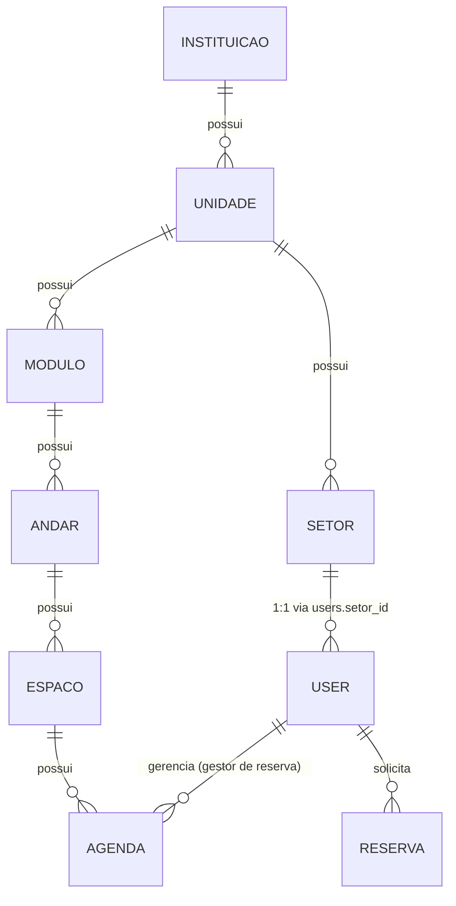
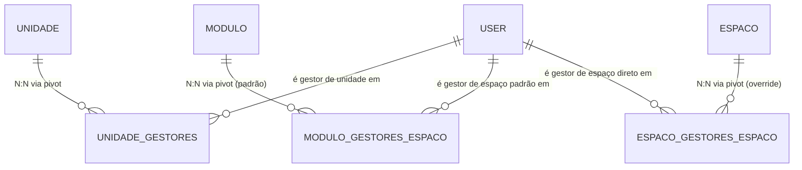

# 04 — Modelo de Dados: Tabelas, Enums e Algoritmos de Resolução

Referência técnica canônica de implementação da v2.0. Contém schemas SQL, modelos Eloquent, enums e algoritmos de precedência para gestão de espaços em cascata (unidade → módulo → espaço).

---

## 1. Diagrama ER — Atual vs. Proposto

### 1.1 Estado Atual (Recorte Relevante)



Nenhuma tabela relaciona `User` a `Unidade` ou a `Modulo` como gestor. Este é o vácuo que a auditoria resolve.

### 1.2 Estado Proposto (Novas Tabelas em Destaque)



Todas as três são **tabelas aditivas** (novas), sem qualquer alteração de coluna/tipo/constraint em tabelas existentes — em conformidade com `docs/REGRAS_INVIOLAVEIS_E_PADROES.md` §2.1 ("Zero Alteração no Schema"; a regra veda alterar/remover, não veda **adicionar** tabelas novas).

---

## 2. Novas Tabelas — Schema Completo

### 2.1 `unidade_gestores` — Gestor de Unidade

```sql
CREATE TABLE unidade_gestores (
    id BIGINT PRIMARY KEY,
    unidade_id BIGINT NOT NULL REFERENCES unidades(id) ON DELETE CASCADE,
    user_id BIGINT NOT NULL REFERENCES users(id) ON DELETE CASCADE,
    created_at TIMESTAMP,
    updated_at TIMESTAMP,
    UNIQUE (unidade_id, user_id)
);
```

**Uso:** N:N — um campus pode ter mais de um Gestor de Unidade; um usuário pode (em tese) gerir mais de um campus, embora o caso de uso comum seja 1 usuário : 1 campus.

- `ON DELETE CASCADE` em `user_id`: se o usuário for removido, o vínculo desaparece (não deixa Unidade "travada"). Hard delete de `User` já não é prática comum no sistema — validar em execução se há necessidade de soft-unlink em vez de cascade.

### 2.2 `modulo_gestores_espaco` — Gestor de Espaço, Vínculo Padrão do Módulo

```sql
CREATE TABLE modulo_gestores_espaco (
    id BIGINT PRIMARY KEY,
    modulo_id BIGINT NOT NULL REFERENCES modulos(id) ON DELETE CASCADE,
    user_id BIGINT NOT NULL REFERENCES users(id) ON DELETE CASCADE,
    created_at TIMESTAMP,
    updated_at TIMESTAMP,
    UNIQUE (modulo_id, user_id)
);
```

**Uso:** N:N — um módulo pode ter 0, 1 ou vários usuários no seu "setor de audiovisual" padrão.

- **Sem** constraint de unicidade em `modulo_id` isolado — ao contrário da proposta anterior (`SetorAudiovisual.modulo_id UNIQUE`), aqui múltiplos usuários podem compor a equipe padrão do módulo, e o mesmo conjunto de usuários pode aparecer em vínculos de módulos diferentes (cross-módulo é uma simples questão de inserir a mesma dupla `user_id` em linhas de módulos distintos — não há necessidade de uma entidade "setor" nomeada para isso).

### 2.3 `espaco_gestores_espaco` — Gestor de Espaço, Override Direto no Espaço

```sql
CREATE TABLE espaco_gestores_espaco (
    id BIGINT PRIMARY KEY,
    espaco_id BIGINT NOT NULL REFERENCES espacos(id) ON DELETE CASCADE,
    user_id BIGINT NOT NULL REFERENCES users(id) ON DELETE CASCADE,
    created_at TIMESTAMP,
    updated_at TIMESTAMP,
    UNIQUE (espaco_id, user_id)
);
```

**Uso:** N:N — um espaço pode ter 1+ gestores diretos (equipe pequena ou pessoa única).

- Nome deliberadamente diferente de `espaco_user` (tabela já existente para favoritos) para eliminar qualquer ambiguidade semântica.
- **Presença de qualquer linha para um `espaco_id`** nesta tabela significa "este espaço tem override — ignore o padrão do módulo" (ver algoritmo abaixo). Isso cobre literalmente os 3 cenários do usuário:
  1. **Módulo sem AV** → só há linha em `espaco_gestores_espaco` (nenhuma em `modulo_gestores_espaco` para aquele módulo) → resolve para o override.
  2. **AV de módulo A cobrindo espaço de módulo B** → insere-se em `espaco_gestores_espaco` os mesmos `user_id` do time de A, para o `espaco_id` de B.
  3. **Espaço específico "escapando" do AV do próprio módulo** → o módulo tem linha em `modulo_gestores_espaco`, mas esse espaço específico também tem linha em `espaco_gestores_espaco` (com usuários diferentes) → o override vence.

---

## 3. Algoritmo de Resolução de Precedência

### 3.1 `getGestoresDeEspaco()` — Resolução Direta

```
função getGestoresDeEspaco(espaco: Espaco) -> Collection<User>:
    overrideUsers = espaco_gestores_espaco WHERE espaco_id = espaco.id

    SE overrideUsers não está vazio:
        RETORNA overrideUsers   // override sempre vence, mesmo que o módulo também tenha padrão

    modulo = espaco.andar.modulo
    padraoUsers = modulo_gestores_espaco WHERE modulo_id = modulo.id

    RETORNA padraoUsers   // pode ser vazio -> espaço é órfão
```

**Espaço é "órfão de Gestor de Espaço"** quando `getGestoresDeEspaco(espaco)` retorna coleção vazia — nem override, nem padrão do módulo. Ver documento 05 para o fluxograma completo, incluindo o roteamento de órfãos ao Gestor de Unidade (escopado) e ao Institucional (visão global).

### 3.2 `getEspacosGeridosPorGestorEspaco()` — Resolução Inversa para Dashboards

```
função getEspacosGeridosPorGestorEspaco(user: User) -> Collection<Espaco>:
    espacosDiretos = Espaco WHERE id IN (SELECT espaco_id FROM espaco_gestores_espaco WHERE user_id = user.id)

    modulosPadrao = Modulo WHERE id IN (SELECT modulo_id FROM modulo_gestores_espaco WHERE user_id = user.id)
    espacosViaModulo = Espaco WHERE andar.modulo_id IN modulosPadrao.ids
                       AND id NOT IN (SELECT espaco_id FROM espaco_gestores_espaco)
                       // excluir espaços que têm QUALQUER override (mesmo de outro usuário) —
                       // senão o dashboard do gestor do módulo mostraria espaços que na
                       // verdade pertencem a outro gestor por override

    RETORNA espacosDiretos UNION espacosViaModulo
```

**O detalhe mais delicado desta modelagem** é a subtração `NOT IN (SELECT espaco_id FROM espaco_gestores_espaco)` — sem ela, um espaço com override para o **usuário B** continuaria aparecendo erroneamente no dashboard do **usuário A** (gestor padrão do módulo), por estar ainda tecnicamente "dentro" do módulo de A. Isso deve virar **teste de regressão obrigatório** na fase de execução:

```
EspacoRepositoryTest::test_override_exclui_espaco_do_padrao_do_modulo
```

---

## 4. Colunas Aditivas em Tabelas Existentes

Tabela consolidada de **todas as alterações de coluna**:

| Tabela | Coluna | Tipo | Nullable | Default | Propósito |
|--------|--------|------|----------|---------|-----------|
| `users` | `tipo_vinculo` | VARCHAR(30) | ❌ Obrigatório | `'externo'` | Taxonomia institucional (estudante/professor/técnico/externo) |
| `unidades` | `label_gestor` | VARCHAR(100) | ✅ Nullable | NULL | Rótulo customizável do cargo por campus (UI only) |
| `horarios` | `origem_avaliacao` | VARCHAR(30) | ❌ Obrigatório | `'fluxo_normal'` | Procedência da decisão (fluxo_normal ou urgencia_gestor_espaco) |
| `setors` | `coordenador_id` | BIGINT FK | ✅ Nullable | NULL | Responsável administrativo pelo setor (SET NULL on delete) |
| `setors` | `horario_abertura` | TIME | ✅ Nullable | NULL | Horário de abertura padrão do expediente |
| `setors` | `horario_fechamento` | TIME | ✅ Nullable | NULL | Horário de fechamento padrão do expediente |
| `setors` | `dias_funcionamento` | JSON | ✅ Nullable | NULL | Dias ISO-8601 de funcionamento (ex.: [1,2,3,4,5]) |
| `tipos_chamado` | `tutorial` | TEXT | ✅ Nullable | NULL | Conteúdo em Markdown ou URL de tutorial assistido |

---

## 5. Nova Tabela: `setor_excecoes_expediente`

### 5.1 Schema

```sql
CREATE TABLE setor_excecoes_expediente (
    id BIGINT PRIMARY KEY,
    setor_id BIGINT NOT NULL REFERENCES setors(id) ON DELETE CASCADE,
    data_inicio DATE NOT NULL,
    data_fim    DATE NOT NULL,          -- = data_inicio quando a exceção é de um único dia
    fechado     BOOLEAN NOT NULL DEFAULT true,
    horario_abertura   TIME NULL,       -- usados apenas quando fechado = false (expediente especial)
    horario_fechamento TIME NULL,
    motivo VARCHAR(255) NULL,           -- "Recesso de fim de ano", "Feriado municipal"
    created_at TIMESTAMP,
    updated_at TIMESTAMP
);
CREATE INDEX idx_excecoes_setor_periodo ON setor_excecoes_expediente (setor_id, data_inicio, data_fim);
```

### 5.2 Casos Cobertos — Intervalo, Não Data a Data

Decisão de menor custo: usar **intervalo** (`data_inicio`/`data_fim`) em vez de uma linha por data. Um recesso de 15 dias vira **1 linha**, não 15.

| Caso | Como fica |
|---|---|
| Feriado de 1 dia, fechado | `data_inicio = data_fim`, `fechado = true` |
| Recesso de 15 dias | 1 linha com intervalo, `fechado = true` |
| Expediente reduzido numa semana | intervalo, `fechado = false` + horários especiais |

---

## 6. Migrations — Ordem Sugerida

1. `YYYY_MM_DD_create_unidade_gestores_table.php`
2. `YYYY_MM_DD_create_modulo_gestores_espaco_table.php`
3. `YYYY_MM_DD_create_espaco_gestores_espaco_table.php`
4. `YYYY_MM_DD_add_tipo_vinculo_to_users_table.php` (NOVO — taxonomia de vínculo institucional)
5. `YYYY_MM_DD_add_label_gestor_to_unidades_table.php` (NOVO — rótulo customizável por campus)
6. `YYYY_MM_DD_add_urgencia_fields_to_horarios_table.php` (NOVO — `origem_avaliacao`)
7. `YYYY_MM_DD_add_coordenador_e_expediente_to_setors_table.php` (NOVO — coordenador e expediente)
8. `YYYY_MM_DD_create_setor_excecoes_expediente_table.php` (NOVO — exceções de expediente)
9. `YYYY_MM_DD_remove_orphan_andares_permissions.php` (NOVO — remove `andares.criar`/`andares.atualizar`)
10. `YYYY_MM_DD_add_gestor_unidade_and_gestor_espaco_roles.php` (migration de dados — cria as duas novas linhas em `roles`)

**Todas são puramente aditivas** — nenhuma coluna existente é alterada ou removida. `down()` é apenas `dropIfExists`/`dropColumn`.

---

## 7. Models Eloquent — Métodos Novos

Recorte de relações novas, sem alterar os métodos existentes:

```php
// app/Models/Unidade.php — adicionar
public function gestores(): BelongsToMany {
    return $this->belongsToMany(User::class, 'unidade_gestores');
}

// app/Models/Modulo.php — adicionar
public function gestoresEspacoPadrao(): BelongsToMany {
    return $this->belongsToMany(User::class, 'modulo_gestores_espaco');
}

// app/Models/Espaco.php — adicionar
public function gestoresEspacoDireto(): BelongsToMany {
    return $this->belongsToMany(User::class, 'espaco_gestores_espaco');
}

// app/Models/User.php — adicionar (espelhando o já existente ->agendas())
public function unidadesGeridas(): BelongsToMany {
    return $this->belongsToMany(Unidade::class, 'unidade_gestores');
}

public function modulosComoGestorEspaco(): BelongsToMany {
    return $this->belongsToMany(Modulo::class, 'modulo_gestores_espaco');
}

public function espacosComoGestorEspacoDireto(): BelongsToMany {
    return $this->belongsToMany(Espaco::class, 'espaco_gestores_espaco');
}
```

**Nota arquitetural:** a lógica de resolução de precedência (§3) fica encapsulada em `EspacoRepositoryInterface::getGestoresDeEspaco()` — não em métodos soltos de Model — seguindo a arquitetura em camadas do projeto (Controller → Service → Repository).

---

## 8. Enums Novos

### 8.1 `TipoVinculoEnum` — Taxonomia Institucional

```php
// app/Enums/TipoVinculoEnum.php  (NOVO — atributo permanente do usuário)
enum TipoVinculoEnum: string {
    case ESTUDANTE = 'estudante';
    case PROFESSOR = 'professor';
    case TECNICO_ADMINISTRATIVO = 'tecnico_administrativo';
    case EXTERNO = 'externo';

    /**
     * Prioridade derivada — taxonomia única (P-25, FECHADA)
     * 
     * Decisão do usuário: "monitor" foi só um exemplo (não vira categoria),
     * técnico-administrativo tem o mesmo grau que professor, e o desempate
     * final fica a critério humano. Logo, não existe enum paralelo — a
     * prioridade é apenas uma função derivada de tipo_vinculo.
     * 
     * @return int  menor número = maior prioridade
     */
    public function prioridadeSugerida(): int {
        return match ($this) {
            self::PROFESSOR, self::TECNICO_ADMINISTRATIVO => 1,  // mesmo grau (P-25)
            self::ESTUDANTE => 2,
            self::EXTERNO => 3,
        };
    }
}
```

**Nota de backfill:** `externo` como *default* é a escolha conservadora — nunca concede prioridade indevida a um usuário legado que não declarou seu vínculo. O cadastro (`StoreRegisterRequest`) passa a coletar o campo; usuários pré-existentes devem ser convidados a corrigir no perfil.

**Empate é esperado e intencional:** professor e técnico-administrativo compartilham o nível 1. A UI deve exibir a sugestão como ordenação/etiqueta, deixando explícito que **o Gestor de Espaço decide** — nunca bloqueando nem reordenando automaticamente.

### 8.2 `OrigemAvaliacaoEnum` — Procedência da Decisão

```php
// app/Enums/SituacaoReserva/OrigemAvaliacaoEnum.php  (NOVO)
enum OrigemAvaliacaoEnum: string {
    case FLUXO_NORMAL = 'fluxo_normal';                     // Gestor de Reserva, caminho padrão
    case URGENCIA_GESTOR_ESPACO = 'urgencia_gestor_espaco';  // exceção, Gestor de Espaço
}
```

---

## 9. Algoritmo `estaEmExpediente()` — Retorno de Três Estados

```php
/**
 * Verifica se um setor está em expediente em um determinado momento.
 * 
 * @param Setor $setor           Entidade do setor
 * @param CarbonInterface $quando Momento a verificar (tipicamente now())
 * @return bool|null
 *   - true:  setor está em expediente
 *   - false: setor está FORA do expediente
 *   - null:  expediente NÃO CONFIGURADO (estado indeterminado)
 */
function estaEmExpediente(Setor $setor, CarbonInterface $quando): ?bool
{
    // 1) Exceção tem precedência absoluta sobre a regra semanal
    $excecao = $setor->excecoesExpediente()
        ->whereDate('data_inicio', '<=', $quando)
        ->whereDate('data_fim', '>=', $quando)
        ->first();

    if ($excecao) {
        if ($excecao->fechado) {
            return false;
        }
        return $quando->between($excecao->horario_abertura, $excecao->horario_fechamento);
    }

    // 2) Sem configuração base => INDETERMINADO (não assume nada)
    if ($setor->horario_abertura === null || $setor->dias_funcionamento === null) {
        return null;
    }

    // 3) Regra semanal padrão
    if (! in_array($quando->dayOfWeekIso, $setor->dias_funcionamento, true)) {
        return false;
    }

    return $quando->between($setor->horario_abertura, $setor->horario_fechamento);
}
```

### 9.1 Por Que o Terceiro Estado (`null`) é Essencial

`User.setor_id` é nullable (confirmado em `StoreRegisterRequest`) e o expediente também. Um retorno booleano forçaria assumir "sempre disponível" ou "sempre indisponível" — ambos errados. Com `null`, o fluxo de urgência trata explicitamente o caso "não sei": **libera com aviso**, o que permite o preenchimento gradual do expediente sem que a funcionalidade nasça inutilizável (risco R-20).

**Tratamento de cada estado** (D-2 + D-6, FECHADAS):

| Estado | Significado | Comportamento | Razão |
|---|---|---|---|
| `false` | Gestor de Reserva **fora** do expediente | ✅ **Libera** a urgência | É exatamente o cenário que a regra existe para cobrir |
| `null` | Expediente **não configurado** | ⚠️ **Libera com aviso** na UI | Será o estado de **100% dos setores no dia do deploy**. Bloquear aqui faria a funcionalidade nascer inutilizável |
| `true` | Gestor de Reserva **está** em expediente | 🚫 **Bloqueia** | O fluxo normal ainda consegue tratar o caso — não há urgência a justificar |

**Estratégia de adoção (D-6):** o expediente é preenchido **gradualmente**. O sistema nasce permissivo (tudo `null`) e vai endurecendo conforme cada setor é configurado.

### 9.2 Semântica Temporal Crítica: `now()`, Não o Horário do Slot

A checagem usa o **momento da aprovação** (`now()`), **não** o horário da reserva solicitada:

> Às **16h**, um aluno pede uma sala para **19h–21h de hoje**. O Gestor de Reserva trabalha até **17h**.
> → A urgência é **bloqueada**, mesmo que o gestor não esteja presente às 19h.

A pergunta que o sistema responde é *"o caminho normal ainda consegue tratar isso?"* — e nesse exemplo ainda há uma hora de expediente para o Gestor de Reserva avaliar. Não é *"o gestor estará presente durante a reserva?"*.

---

## Índice de Referências

- **Algoritmo de precedência:** §3 (decisões de precedência em cascata)
- **Escopo do Gestor de Unidade:** `docs/core-workflow-report.md` (fluxo de avaliação escopado)
- **Integração com urgência:** §9 (expediente como pré-condição de fluxo de urgência)
- **Autorização de reservas:** `docs/authorization-policies.md` (ReservaPolicy e escopagem)
- **Enums canônicos:** `docs/enums-and-constants.md`
- **Auto-aprovação:** `docs/auto-approval-rule.md`
