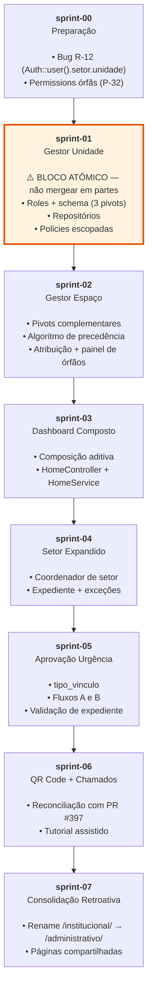

# Roadmap v2.0 — Grafo de Dependências Entre Sprints

> **Documento de sequenciamento.** Define a ordem de execução dos 8 sprints que consolidam a v2.0,
> com suas dependências explícitas e justificativas de precedência.
>
> **Origem:** Auditoria técnica de 5 rodadas (43 decisões de negócio, 23 riscos mapeados).
> As 13 fases originais (F0–F12) foram consolidadas nos 8 sprints abaixo.

---

## Grafo de Dependências

---

## Por Que Esta Ordem

### sprint-00-preparacao

**Dívida técnica obrigatória — executa primeiro porque evita retrabalho.**

- Corrige o bug latente **R-12** (`Auth::user()->setor->unidade` sem null-safety em 5 controllers e `UserService`)
  que será **tocado novamente** em sprint-01 (para estender o escopo com `unidade_gestores`). Resolver agora
  previne conflitos de merge.
- Remove as **permissions órfãs** `andares.criar`/`andares.atualizar` (P-32) — existem no `PermissionSeeder`
  mas nunca são verificadas no backend. Andar não tem ciclo de vida independente de Módulo; removê-las evita
  que futuros administradores de roles fiquem confusos.

Se pulado, sprint-01 toca os mesmos arquivos e gera conflitos. Sprint-00 é uma "limpeza preliminar" pura,
sem dependência reversa.

### sprint-01-gestor-unidade

**⚠️ BLOCO ATÔMICO — deve entrar inteiro, nunca mergeado em partes. Risco crítico R-18.**

Sprint-01, 02 e 03 são conceitual e tecnicamente separáveis — mas sprint-01 abre um **buraco de segurança
se for enterrado isolado**:

1. As rotas administrativas são liberadas por `middleware(['permission:secao.gestao-*'])` (sem escopo adicional
   no controller).
2. Conceder `secao.gestao-modulos`/`-setores`/`-espacos` ao `gestor_unidade` **sem o filtro de `unidade_id`**
   implementado (que vem no sprint-02) faria ele enxergar os **3 campi UESB inteiros**.
3. Isso é R-18 — sequenciamento de permissions em nível crítico.

**Resolução:** as Phases 1, 2 e 3 da auditoria original (F1→F2→F3) entram em **um único sprint**, com:
- Roles novas (`gestor_unidade`, `gestor_espaco`) + schema (3 pivots, `tipo_vinculo`, `label_gestor`)
- Repositórios com o algoritmo de precedência (Espaço > Módulo)
- Policies escopadas que consultam `unidade_gestores` e `*_gestores_*`
- **Concessão das permissions** só acontece no final, quando as Policies já estão em produção

Isso garante que permissão e escopo entram juntos — `develop` nunca fica com permissão sem Policy.

### sprint-02-gestor-espaco

**Continuação do modelo de atores, mas agora focando no segundo papel.**

Dado que sprint-01 resolveu a arquitetura de atribuição e precedência para gestor_unidade,
o segundo ator (gestor_espaco) reutiliza a mesma estrutura:

- Pivots `modulo_gestores_espaco` e `espaco_gestores_espaco` (já criados em sprint-01, replicam o padrão)
- O algoritmo de precedência já está em `EspacoRepository::getGestoresDeEspaco()`
- Telas de atribuição e painel de órfãos (complementam sprint-01)

Sprint-01 + sprint-02 = consolidação de **duas taxonomias de governança** (campus-level e espaço-level),
mas tecnicamente separados — permite reviewar cada ator sem sobrecarregar a PR.

### sprint-03-dashboard-composto

**Cumpre a exigência P-21 de páginas compartilhadas; depende de ambos os atores já estarem escopados.**

`HomeController` e `HomeService` hoje usam `match(true)` / `if-elseif` — precedência exclusiva, esconde dados
de quem acumula papéis (R-17). Sprint-03 transforma isso em composição **aditiva por permissão**:

- Cada bloco condiciona-se a `if (user.can('secao.dashboard-gestor'))`, nunca a `if (role === ...)`.
- O Institucional que também é Gestor de Unidade agora vê **ambos** os blocos.

Só faz sentido **depois que** gestor_unidade e gestor_espaco estão em produção com suas próprias permissions.
Antes disso, não há blocos novos para composição.

### sprint-04-setor-expediente

**Expande a entidade `Setor` com a semântica de operação (P-23); vem **antes** da urgência (sprint-05).**

O expediente de um setor é o que **torna verificável** a aprovação por urgência. Implementar urgência sem
expediente entrega uma feature frágil (baseada em confiança, R-09 em nível alto). Sprint-04 fornece:

- Colunas aditivas em `Setor` (`horario_abertura`, `horario_fechamento`, `dias_funcionamento`)
- Tabela `setor_excecoes_expediente` (recesso, recessos, etc.)
- `coordenador_id` (FK para o usuário responsável por editar o expediente do setor — P-23)
- Método `Setor::estaEmExpediente()` com 3 estados: `true`, `false`, `null`

Sprint-05 consome `estaEmExpediente()` para bloquear/avisar urgências. Se inverter a ordem, urgência nasce
sem a trava e a vulnerabilidade cresce.

### sprint-05-aprovacao-urgencia

**Usa o expediente de sprint-04 para implementar o portão de segurança da urgência.**

Implementa os **Fluxos A e B** de aprovação (UC-21-A e UC-21-B):

- Fluxo A: solicitante cria reserva fora do expediente, gestor_reserva aprova por urgência
- Fluxo B: gestor_espaco cria no balcão (walk-in), marcando a origem

Ambos consultam `Setor.estaEmExpediente()` do setor do gestor:
- `false` ou `null` → urgência **liberada** (ou liberada com aviso)
- `true` → urgência **bloqueada** (o caminho normal ainda tem tempo)

Essa validação é o que diferencia urgência "saudável" (restrita) de urgência "abusada" (cotidiana).

### sprint-06-qrcode-chamados

**Integra o módulo de chamados (PR #397) ao escopo de gestores de espaço.**

Reconcilia o trabalho da branch `feat/tickets-module` com a arquitetura de atores consolidada:

- QR Code posicionado no espaço, levando a `/reportar/{public_id}`
- Tutorial assistido antes de abrir o chamado (P-20, D-9 — Markdown sanitizado)
- Reconhecimento de **gestores de espaço** que podem triar/fechar chamados (reutiliza `EspacoRepository::getGestoresDeEspaco()`)
- Painel de chamados órfãos (diferenciação P-10: Gestor de Unidade vê detalhe, Institucional vê agregação)

Tecnicamente **independente** dos sprints 01–05, mas deixado por último porque:
1. PR #397 já existe e apenas precisa ser "adaptada" à arquitetura nova (não é bloqueante para urgência)
2. Gestores de espaço precisam estar consolidados (sprint-02) antes de se responsabilizarem por chamados

### sprint-07-consolidacao-retroativa

**Rename estrutural + consolidação de páginas — fica quase no fim porque necessita conhecer todos os blocos.**

Executa as mudanças de "superfície" que R-15 documentou:

- Rename do prefixo de rotas `/institucional` → `/administrativo` (D-7) — mudança em 51 referências em
  `resources/js`, via Ziggy 2.5.2 (rotas expostas por nome). Atômico: rename **nome e URL em uma única PR**.
- Consolidação retroativa de páginas inteiras (`DashboardGestorPage` + `DashboardInstitucionalPage` → `DashboardPage`
  único com blocos), agora possível porque a composição aditiva de sprint-03 já existe.

Deixado por último porque:
1. Depende de conhecer **quais blocos** cada página composta precisa reunir → só se sabe depois que todos os
   atores estão implementados (sprints 01–05).
2. As mudanças são cosmética + refatoração — **não adicionam funcionalidade**, apenas reorganizam código
   existente. Atrasar permite que features de valor (urgência, QR Code) entrem em produção antes.

---

## Definição de Versão Estável — Regra Geral

Cada sprint termina quando `develop` **está deployável em produção** sem funcionalidade quebrada, mesmo que
a v2.0 ainda esteja incompleta.

Nenhum sprint pode encerrar violando qualquer um dos itens abaixo:

### 1. Migration Sem Código Consumidor

❌ Aplicar uma migração de schema novo sem que a aplicação tenha código que a popule ou consulte.

✅ **Correto:** migração + Model com accessors/mutators + repositório que consulta → entram na mesma sprint ou a sprint seguinte **imediatamente**.

**Exemplo de violação:** criar a tabela `unidade_gestores` em sprint-01, mas deixar o controller retornando
a lista de gestores vazia até sprint-02 → `develop` fica com tabela órfã.

### 2. Permission Sem Policy Escopada

❌ Conceder `secao.gestao-modulos` a um role novo sem que o `ModuloPolicy` já filtre por unidade.

✅ **Correto:** Policy é estendida **antes ou na mesma sprint** da concessão da permission.

**Exemplo (R-18):** conceder `secao.gestao-*` ao `gestor_unidade` sem `ModuloPolicy`, `SetorPolicy`,
`EspacoPolicy` verificarem `unidade_id` → gestor de campus A enxerga campus B (exposição cross-campus).

Sprint-01 é **atômico** justamente para evitar essa janela.

### 3. Tela Referenciando Endpoint Inexistente

❌ Componente React chamando `route('institucional.modulos.store')` quando a rota ainda não existe.

✅ **Correto:** endpoint + Controller + método de HTTP + teste de autorização → vêm **antes** do componente
que o chama.

**Exemplo de violação:** sprint-02 cria o frontend de "atribuir gestor de espaço", mas o controller que
persiste a atribuição fica para sprint-03 → tela quebrada.

### 4. Role Criada Sem Forma de Atribuição

❌ Criar o role `gestor_unidade` no `RoleSeeder`, mas deixar o painel de administração de roles sem qualquer
formulário para atribuir esse role a usuários.

✅ **Correto:** formulário de atribuição (tela + endpoint) entra **na mesma sprint** ou **imediatamente após**.

**Exemplo (P-03):** gestor_unidade deve permitir múltiplos por campus. Sem o formulário de atribuição,
não há forma de designar o segundo gestor.

---

## Tabela-Resumo

| Sprint | Entrega Principal | Mapeamento à Auditoria | Depende De | Bloqueia |
|---|---|---|---|---|
| **sprint-00-preparacao** | Bug R-12 + permissions órfãs (P-32) | Preparação parcial (F0) + limpeza (F4) | Nenhuma | Nenhum (limpeza) |
| **sprint-01-gestor-unidade** | 🔴 Bloco atômico: role + 3 pivots + Policies escopadas | Fases 1+2+3 (F1→F2→F3) | sprint-00 | sprint-02, sprint-03 |
| **sprint-02-gestor-espaco** | Pivots complementares + algoritmo + atribuição + órfãos | Continuação de F1-F3 para 2º ator + F9 | sprint-01 | sprint-03 |
| **sprint-03-dashboard-composto** | Composição aditiva (HomeController + HomeService) | Fase 6 (F6) | sprint-02 | sprint-04 |
| **sprint-04-setor-expediente** | Coordenador de setor + expediente + exceções | Fase 7 (F7) | sprint-03 | sprint-05 |
| **sprint-05-aprovacao-urgencia** | Fluxos A e B de urgência + tipo_vinculo | Fase 8 (F8) | sprint-04 | sprint-06 |
| **sprint-06-qrcode-chamados** | QR Code + tutorial + reconciliação PR #397 | Fase 10 (F10) | sprint-05 | sprint-07 |
| **sprint-07-consolidacao-retroativa** | Rename `/institucional/` → `/administrativo/` + páginas compartilhadas | Fase 11 (F11) | sprint-06 | Nenhum (fim) |

---

## Relação com as Fases Originais da Auditoria (F0–F12)

A auditoria mapeou o trabalho em 13 fases sequenciais (F0–F12). Os 8 sprints consolidam múltiplas fases:

| Fases Originais | Sprint Correspondente | Razão da Consolidação |
|---|---|---|
| F0 (decisões D-1–D-4) + parte de F4 (limpeza) | sprint-00 | Dívida técnica executada antes de qualquer feature |
| F1→F2→F3 (roles, schema, policies — **bloco atômico**) | sprint-01 | Risco R-18 exige que permissão e escopo entrem juntos; separar criaria janela de exposição |
| Continuação de F1–F3 (atores complementares) + F9 (órfãos) | sprint-02 | Reutiliza arquitetura de sprint-01; pode ser reviewada como PR separada |
| F6 (dashboard composto) | sprint-03 | Depende de ambos os atores em produção |
| F7 (setor expandido: coordenador + expediente + exceções) | sprint-04 | Vem antes de F8; expediente é pré-requisito da urgência verificável |
| F8 (aprovação por urgência) | sprint-05 | Consome `estaEmExpediente()` de sprint-04; risco R-09 atenuado pela validação |
| F10 (QR Code + tutorial + módulo de chamados) | sprint-06 | Tecnicamente independente, mas adaptado ao escopo de gestores de espaço de sprint-02 |
| F11 (rename de rotas + consolidação de páginas) | sprint-07 | Deixado por último porque cosmético; precisa conhecer todos os blocos novos de sprints anteriores |
| F12 (documentação) | Contínuo durante execução | Registrado em `docs/v2.0/observacoes/` conforme surgem achados |

**Nota:** F0 (dúvidas D-1–D-4) foi **resolvida durante a auditoria** (Rodada 5). Sprint-00 é a execução
dessa resolução.

---

## Estrutura de Cada Sprint

Cada sprint tem um `README.md` próprio (ex.: `sprints/sprint-01-gestor-unidade/README.md`) que detalha:

- **Objetivo:** uma frase do que muda no sistema
- **Definição de Versão Estável:** o que a "Regra Geral" acima significa concretamente para este sprint
- **Casos de uso cobertos:** UC-XX lista
- **Backlog:** tasks nomeadas (`S{n}-{trilha}-{nn}`) com critérios de aceite
- **Ordem de execução:** backend → frontend → integração (conforme §4.4 do README.md da v2.0)

---

## Referências Relacionadas

- [`../00-visao-geral/04-regras-invioaveis.md`](../00-visao-geral/04-regras-invioaveis.md) — As 6 regras que
  nenhum sprint pode violar
- [`../00-visao-geral/03-decisoes-consolidadas.md`](../00-visao-geral/03-decisoes-consolidadas.md) — Todas as
  43 decisões (P-01 a P-34, D-1 a D-9) com rastro de origem
- [`../sprints/`](../sprints/) — Backlog detalhado de cada sprint
- [`../observacoes/README.md`](../observacoes/README.md) — Como registrar achados durante a execução
