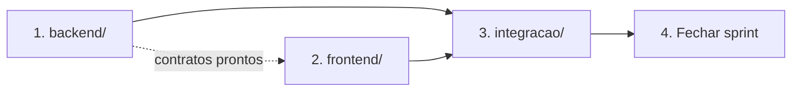

# UniEspaços 2.0 — Documentação Preparatória da Migração de Versão

> **Documento base norteador.** Se você só vai ler um arquivo desta pasta, leia este.
>
> **Status:** Documentação preparatória concluída · Implementação não iniciada
> **Origem:** 5 rodadas de auditoria técnica (43 decisões de negócio fechadas, 24 casos de uso, 23 riscos mapeados)
> **Alvo:** Introdução de 2 novos atores (Gestor de Espaço e Gestor de Unidade) e redistribuição da governança

---

## 1. O Que É a Versão 2.0

O UniEspaços 1.x opera com **3 papéis** (`comum`, `gestor`, `institucional`) e um modelo binário de governança: ou
o usuário administra a agenda de um turno específico, ou é administrador global com poder irrestrito sobre os 3
campi da UESB. Não existe camada intermediária.

A versão 2.0 resolve isso introduzindo **2 novos atores** e redistribuindo responsabilidades:

| | 1.x (hoje) | 2.0 (alvo) |
|---|---|---|
| **Papéis** | 3 | 5 |
| **Governança de campus** | Inexistente — Institucional opera os 3 campi | **Gestor de Unidade** conduz seu campus; Institucional recua para bootstrap + analytics |
| **Manutenção de infraestrutura** | Confundida com gestão de agenda | **Gestor de Espaço**, papel próprio, resolvido por precedência (Espaço > Módulo) |
| **Aprovação fora de expediente** | Impossível — reserva fica represada | Aprovação por **urgência**, restrita ao mesmo dia, com validação de expediente |
| **Report de problemas** | Inexistente | **QR Code** no espaço, com tutorial assistido antes de abrir chamado |
| **Dashboard multi-papel** | Cascata exclusiva — esconde dados de quem acumula papéis | Composição aditiva por permissão |

Detalhamento completo: [`00-visao-geral/01-escopo-e-objetivos.md`](./00-visao-geral/01-escopo-e-objetivos.md).

---

## 2. Como Esta Documentação Está Organizada

```
docs/v2.0/
├── README.md                    ← você está aqui
│
├── 00-visao-geral/              O QUÊ e POR QUÊ
│   ├── 01-escopo-e-objetivos.md
│   ├── 02-atores-e-papeis.md         5 atores, matriz de atribuições
│   ├── 03-decisoes-consolidadas.md   as 43 decisões fechadas, com rastro
│   ├── 04-regras-invioaveis.md       o que NUNCA pode ser violado
│   └── 05-glossario.md               vocabulário do domínio
│
├── 01-casos-de-uso/             O QUE O SISTEMA FAZ
│   ├── README.md                     índice UC-01..UC-24
│   ├── 01-casos-existentes.md        UC-01..UC-12 (1.x) + impacto da 2.0
│   └── 02-casos-novos.md             UC-13..UC-24 (novos na 2.0)
│
├── 02-fluxos-e-diagramas/       COMO FUNCIONA
│   ├── 01-fluxos-por-ator.md         jornada de cada papel
│   ├── 02-fluxos-de-tela.md          navegação e telas
│   ├── 03-diagramas-de-sequencia.md  interação entre camadas
│   └── 04-modelo-de-dados.md         ER atual × alvo, migrations
│
├── 03-arquitetura/              COMO CONSTRUIR
│   ├── 01-backend.md                 camadas, contratos, padrões
│   ├── 02-frontend.md                composição por permissão, contratos SSOT
│   ├── 03-matriz-de-permissions.md   permission × role, definitiva
│   └── 04-migrations.md              ordem, reversibilidade, backfill
│
├── 04-roadmap/                  QUANDO E EM QUE ORDEM
│   ├── README.md                     grafo de dependências entre sprints
│   └── matriz-rastreabilidade.md     UC × Sprint × Task × Risco
│
├── sprints/                     O TRABALHO
│   └── sprint-0X-nome/
│       ├── README.md                 objetivo + definição de "versão estável"
│       ├── backend/BACKLOG.md
│       ├── frontend/BACKLOG.md
│       └── integracao/BACKLOG.md
│
└── observacoes/                 O QUE APRENDEMOS DURANTE A EXECUÇÃO
    ├── README.md                     como registrar
    ├── PROBLEMAS-IDENTIFICADOS.md
    ├── DESVIOS-E-DECISOES.md
    └── REVISAO-PERIODICA.md
```

---

## 3. Por Onde Começar (Por Perfil)

| Se você é… | Leia nesta ordem |
|---|---|
| **Novo no projeto** | `00-visao-geral/05-glossario.md` → `02-atores-e-papeis.md` → `01-casos-de-uso/README.md` |
| **Vai executar uma task** | O `BACKLOG.md` da sua trilha → o UC citado na task → `03-arquitetura/` da sua camada |
| **Vai revisar código** | `00-visao-geral/04-regras-invioaveis.md` → `03-matriz-de-permissions.md` → critérios de aceite da task |
| **Vai planejar o próximo ciclo** | `04-roadmap/README.md` → `observacoes/REVISAO-PERIODICA.md` |
| **Quer entender uma decisão** | `00-visao-geral/03-decisoes-consolidadas.md` (todas rastreadas por ID) |

---

## 4. Como Gerenciar a Implementação das Tasks

### 4.1 Anatomia de uma Task

Toda task no backlog segue este formato, sem exceção:

```markdown
### [S1-BE-04] Título curto e imperativo

- **Objetivo:** uma frase — o que muda no sistema quando isto estiver pronto.
- **Caso de uso:** UC-15
- **Atores envolvidos:** Gestor de Unidade, Institucional
- **Partes afetadas:** lista de arquivos/camadas concretos
- **Depende de:** S1-BE-01, S1-BE-02  (ou "nenhuma")
- **Riscos relacionados:** R-18
- **Casos de teste obrigatórios:** lista nomeada — cada um declara o que prova
- **Critérios de aceite:** checklist objetivo e verificável
```

### 4.2 Identificação de Tasks

`S{sprint}-{trilha}-{sequência}`

| Componente | Valores |
|---|---|
| `S{sprint}` | `S0` a `S7` |
| `{trilha}` | `BE` (backend) · `FE` (frontend) · `INT` (integração) |
| `{sequência}` | `01`, `02`, … dentro da trilha |

Exemplo: `S5-BE-07` = Sprint 5, backend, sétima task.

### 4.3 As Três Trilhas

| Trilha | Escopo | Executor sugerido |
|---|---|---|
| **backend** | Migrations, Models, Repositories, Services, Policies, Controllers, Requests, Notifications, Jobs, seeders | agente `backend` |
| **frontend** | Contratos SSOT, páginas, organisms/molecules/atoms, i18n, constantes de permissão | agente `frontend` |
| **integracao** | Testes que cruzam camadas, testes de autorização, seeds de cenário, validação de contrato backend↔frontend, verificação de regressão | agente `backend` ou `frontend`, conforme o teste |

**Por que separar "integração":** os riscos mais graves desta migração (R-01, R-18 — vazamento de escopo entre
campi) só aparecem quando backend e frontend estão juntos. Isolar esses testes numa trilha própria evita que
fiquem órfãos entre as duas pontas.

### 4.4 Ordem de Execução Dentro de um Sprint



1. **Backend primeiro** — estabelece schema, contratos e autorização.
2. **Frontend em seguida** — consome o que o backend expôs. Pode começar em paralelo assim que os contratos
   (`resources/js/contracts/`) estiverem definidos.
3. **Integração por último** — valida o conjunto.
4. **Fechar sprint** — só quando a "Definição de Versão Estável" do `README.md` do sprint for satisfeita.

### 4.5 Definição de Pronto (Definition of Done)

Uma task só está pronta quando **todos** os itens abaixo forem verdadeiros:

- [ ] Todos os critérios de aceite da task marcados
- [ ] Todos os casos de teste listados na task **implementados e passando**
- [ ] `npx tsc --noEmit` retorna 0 (se tocou frontend)
- [ ] `npx jest` — 100% verde (se tocou frontend)
- [ ] `docker exec -e APP_ENV=testing uniespacos-workspace-1 php artisan test` — 100% verde (se tocou backend)
- [ ] `npx eslint resources/js --suppressions-location <(echo '{}')` sem novas supressões
- [ ] `docker exec uniespacos-workspace-1 vendor/bin/pint` aplicado (se tocou PHP)
- [ ] Nenhuma regra de [`04-regras-invioaveis.md`](./00-visao-geral/04-regras-invioaveis.md) violada

> ⚠️ **Teste não é opcional e não pode ser afrouxado.** Se um teste falha, a causa raiz é corrigida — nunca se
> usa `.skip`, `markTestIncomplete()`, mock que engole erro, ou asserção relaxada para "passar". Um teste
> desativado é uma task **não concluída**.

### 4.6 Definição de Versão Estável (Fim de Sprint)

Cada sprint tem, no seu `README.md`, uma seção **"Definição de Versão Estável"**. A regra geral:

> Ao fim de qualquer sprint, `develop` deve estar **deployável em produção** sem funcionalidade quebrada, mesmo
> que a v2.0 ainda esteja incompleta.

Isso significa que **nenhum sprint pode terminar com**:
- Migration aplicada sem o código que a consome (ou vice-versa)
- Permission concedida sem a Policy que a escopa — ver **R-18**, o risco mais crítico desta migração
- Tela referenciando endpoint inexistente
- Role criada sem nenhuma forma de atribuí-la

### 4.7 Registro Durante a Execução

Todo achado, desvio ou problema encontrado durante a implementação vai para
[`observacoes/`](./observacoes/README.md) — **no momento em que acontece**, não no fim.

| Situação | Onde registrar |
|---|---|
| Bug pré-existente descoberto | `PROBLEMAS-IDENTIFICADOS.md` |
| Precisou divergir do que o backlog dizia | `DESVIOS-E-DECISOES.md` |
| Dúvida de negócio que travou a task | `PROBLEMAS-IDENTIFICADOS.md` (marcar como bloqueante) |
| Revisão de fim de ciclo | `REVISAO-PERIODICA.md` |

---

## 5. Regras Invioláveis (Resumo — a Lista Completa Está no Documento Próprio)

Estas seis quebram o projeto se violadas. A lista completa e comentada está em
[`00-visao-geral/04-regras-invioaveis.md`](./00-visao-geral/04-regras-invioaveis.md).

1. **Nunca `RefreshDatabase` em teste** — apaga o banco de desenvolvimento. Sempre `DatabaseTransactions`.
2. **Banido:** `migrate:fresh`, `migrate:reset`, `db:wipe`, `cache:clear --database`.
3. **Toda `Notification` implementa `ShouldQueue`**; `notify()` dentro de Job sempre em `try-catch`.
4. **Autorização por permission, nunca por nome de papel** — proibido `role === 'gestor_espaco'`.
5. **Escopo é decidido no backend.** O frontend nunca filtra dado sensível.
6. **Tolerância zero a supressões de linter** em código novo.

---

## 6. Estado da Preparação

| Item | Situação |
|---|---|
| Decisões de negócio | ✅ 43 fechadas (P-01..P-34, D-1..D-9) |
| Casos de uso | ✅ 24 mapeados (12 existentes + 12 novos) |
| Riscos | ✅ 23 catalogados com mitigação |
| Modelo de dados | ✅ Definido — 4 tabelas novas, 6 colunas aditivas |
| Matriz de permissions | ✅ Definitiva |
| Backlog | ✅ 8 sprints, tasks detalhadas |
| Implementação | ⬜ Não iniciada |

**Única decisão assumida por omissão:** formato do tutorial do QR Code (Markdown sanitizado — a rota é pública,
HTML livre seria vetor de XSS). Registrada em
[`03-decisoes-consolidadas.md`](./00-visao-geral/03-decisoes-consolidadas.md), item D-9.

---

## 7. Rastreabilidade com a Auditoria de Origem

Esta documentação é a consolidação executável de `docs/auditoria-gestores-unidade-espaco/` (não versionada no
git — é material de trabalho). Todos os identificadores foram preservados para rastreio:

| Prefixo | Significado | Exemplo |
|---|---|---|
| `UC-XX` | Caso de uso | UC-21-A (aprovação de urgência, Fluxo A) |
| `P-XX` | Decisão de negócio (rodadas 1–4) | P-15 (urgência só no mesmo dia) |
| `D-X` | Decisão de implementação (rodada 5) | D-2 (comportamento por estado do expediente) |
| `R-XX` | Risco mapeado | R-18 (sequenciamento de permissions) |
| `S{n}-{trilha}-{nn}` | Task de backlog | S5-BE-07 |
