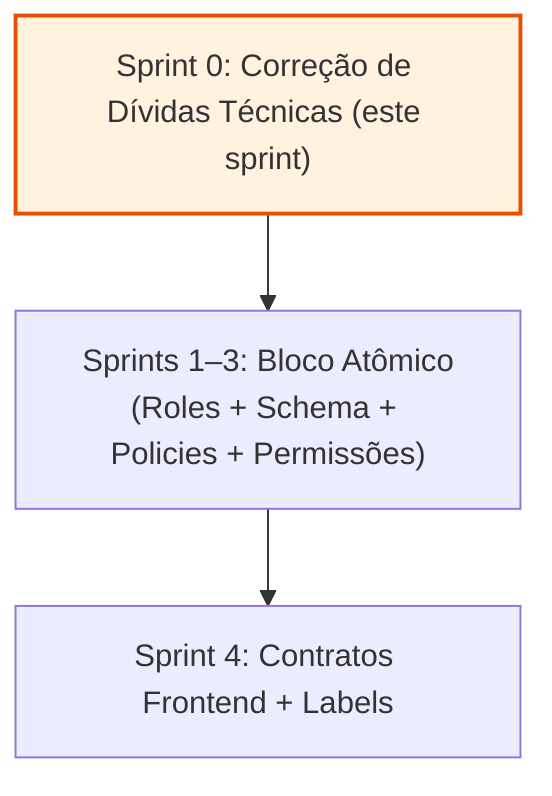

# Sprint 0 — Preparação: Correção de Dívidas Técnicas Pré-Existentes

> **Objetivo:** Sanear duas dívidas técnicas latentes antes de introduzir os novos atores (Gestor de Unidade e
> Gestor de Espaço), para que as fases seguintes não herdem nem o bug nem as permissions órfãs.

## Resumo Executivo

Este sprint **não introduz nenhum ator novo, nenhuma tabela nova, nenhuma permission nova**. É exclusivamente
**correção técnica**.

### O que entrega

1. **Correção do bug R-12:** Remoção de NPE quando usuário `institucional` não tem `setor_id` atribuído
   - Helper null-safe para resolução do escopo institucional
   - Aplicação em 5 controllers + `UserService`
   - Cobertura de testes de regressão

2. **Limpeza de permissions órfãs:** Remoção de `andares.criar` e `andares.atualizar`
   - Migration aditiva (remoção de dados, não de estrutura)
   - Atualização de rótulos no frontend
   - Validação de que nenhuma referência residual existe

### O que NÃO entrega

- ❌ Nenhum novo role (`gestor_unidade`, `gestor_espaco`)
- ❌ Nenhuma nova tabela (pivots, `setor_exceções_expediente`, etc.)
- ❌ Nenhuma nova permission
- ❌ Nenhuma tela nova ou refatoração de fluxo

## Definição de Versão Estável (Fim de Sprint)

Ao encerramento do Sprint 0, `develop` estará em estado **100% deployável**:

- ✅ Nenhuma rota administrativa retorna erro 500 para usuário `institucional` sem `setor_id`
- ✅ `andares.criar` e `andares.atualizar` não existem mais no banco nem no frontend
- ✅ Nenhuma regressão nos testes de autorização existentes
- ✅ `npx tsc --noEmit` retorna 0
- ✅ `npx jest` — 100% verde
- ✅ `docker exec -e APP_ENV=testing uniespacos-workspace-1 php artisan test` — 100% verde

## Dependências

**Nenhuma.** Este é o primeiro sprint de toda a série.

## Referências Relacionadas

- [Regras Invioláveis da Arquitetura](../../00-visao-geral/04-regras-invioaveis.md)
- [Decisões Consolidadas](../../00-visao-geral/03-decisoes-consolidadas.md) — P-24 (corrigi R-12 dentro desta
  iniciativa), P-32 (remover permissions órfãs)
- [Auditoria de Origem — Matriz de Riscos](../../auditoria-gestores-unidade-espaco/07-matriz-riscos-lacunas-perguntas-abertas.md) — §2.1 e §2.4-F (localização exata do bug e das permissions órfãs)

## Roadmap Geral

**Motivo do Sprint 0:** Corrigir estas fragilidades **antes** de tocar os 5 mesmos arquivos para o escopo do
Gestor de Unidade reduz risco de conflitos de merge e garante que nenhuma fase subsequente herda o bug.
